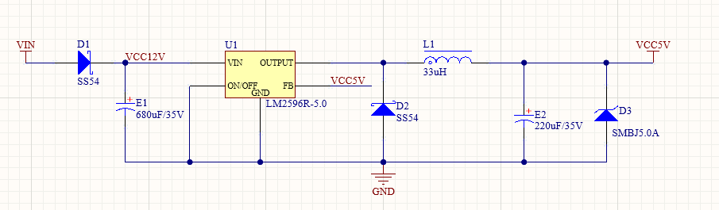
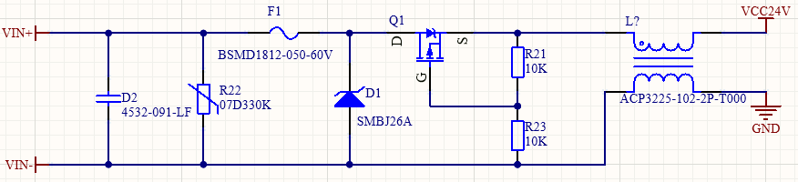
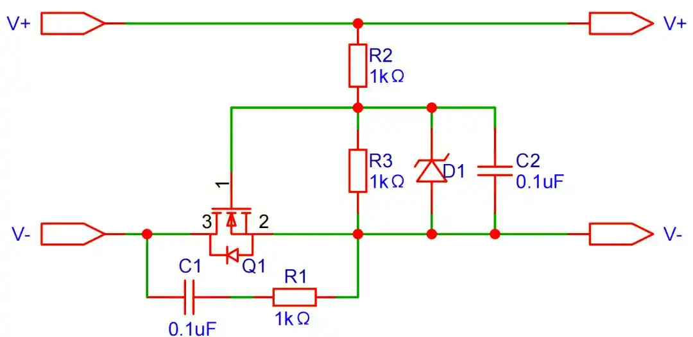
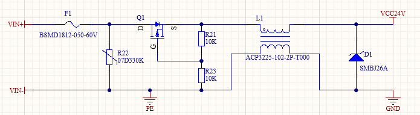

## 1 防反接保护

### 1.1 串联二极管



**工作原理：**
- 在电源正极串联一个二极管（通常使用肖特基二极管）
- 正接时：二极管导通，电流正常流过，电路工作正常
- 反接时：二极管截止，阻断反向电流，保护后级电路

**优点：**
- 电路简单，成本低
- 保护效果可靠

**缺点：**
- 有压降损耗（约0.3-0.7V）
- 功耗较大，效率降低

### 1.2 并联二极管


**工作原理：**
- 在电源输入端并联一个反向二极管
- 正接时：并联二极管反向截止，不影响正常工作
- 反接时：并联二极管导通，跟保险丝形成环路短路，触发保险丝熔断或上级保护

**优点：**
- 无压降损耗
- 正常工作时效率高

**缺点：**
- 需要配合保险丝或限流电阻使用
- 反接时会产生大电流，可能损坏电源
- 二极管两端会有 -0.3V ~ -0.5V压降，后级电路也会有 -0.3V ~ -0.5V电压。

### 1.3 MOS管反接保护

#### 1.3.1 PMOS反接保护



**优点：**
- ✅ 压降极小（仅Rds(on)压降，通常<0.1V）
- ✅ 效率高，功耗低（Rds(on)通常几十mΩ）
- ✅ 电路简单，成本适中
- ✅ 保护可靠，不会烧毁
- ✅ 适合低压大电流场合

**缺点：**
- ❌ PMOS导通电阻比NMOS大（同等条件下）
- ❌ 体积相对较大（需要大电流PMOS封装大）
- ❌ 成本比二极管略高
- ❌ 没有防倒灌

#### 1.3.2 NMOS反接保护



**优点：**
- ✅ 导通电阻最小（Rds(on)可低至几mΩ）
- ✅ 效率最高，发热最小
- ✅ 大电流能力强
- ✅ 同等电流下封装更小
- ✅ 成本相对较低

**缺点：**
- ❌ 电路稍复杂（需要额外的栅极驱动电路）
- ❌ 接在低端，可能影响地参考（输入和输出地相差Vds压差）
- ❌ 某些应用中不适合（需要共地的场合）
- ❌ 需要考虑体二极管的影响

## 2 气体放电管（GDT - Gas Discharge Tube）

### 2.1 工作原理

气体放电管是一种充满惰性气体（如氩气、氖气）的陶瓷或玻璃管，两端有金属电极。

**工作过程：**
- 正常工作时：管内气体不导电，呈现高阻态（GΩ级）
- 浪涌来临时：当电压超过击穿电压，气体电离形成电弧，呈现低阻态（<1Ω）
- 浪涌过后：电压降低后气体去电离，恢复高阻态

### 2.2 主要特性

**优点：**
- ✅ 能量吸收能力极强（可达几千焦耳）
- ✅ 残压很低（导通后仅10V~30V）
- ✅ 绝缘电阻极高（正常时>10¹⁰Ω）
- ✅ 寿命长，可重复使用
- ✅ 漏电流极小（<1μA）
- ✅ 适合承受雷击等超大能量浪涌

**缺点：**
- ❌ 响应速度慢（μs级，通常0.1~1μs）
- ❌ 击穿电压精度低（±20%）
- ❌ 存在续流问题（AC电路中）
- ❌ 成本较高
- ❌ 体积较大

### 2.3 为什么工业DC24V不使用GDT？

**核心原因：DC电路的续流问题**

```
续流（Follow Current）现象：
━━━━━━━━━━━━━━━━━━━━━━━━━━━━━━━━━
GDT导通后，即使电压降低，仍保持导通状态
需要电流降至维持电流（50mA~100mA）以下才能熄弧
```

**在DC 24V电路中的表现：**

```
浪涌前：
24V DC ───┬─── 负载
          │
        [GDT] ← 高阻态（GΩ级）
          │
         GND

浪涌时：
24V DC ───┬─── 负载
          │
        [GDT] ← 导通（<1Ω）✅ 吸收浪涌
          │
         GND

浪涌后（严重问题）：
24V DC ───┬─── 负载
          │
        [GDT] ← 持续导通 ❌❌❌
          │    无法熄弧！
         GND

原因：
1. DC 24V持续提供电流
2. 无交流过零点
3. 电流始终>维持电流（50mA）
4. GDT永远无法关断
5. 形成持续短路 → 烧毁电源或GDT
```

## 3 压敏电阻（MOV - Metal Oxide Varistor）

### 3.1 工作原理

压敏电阻是一种非线性电阻器件，主要由氧化锌（ZnO）陶瓷材料制成。

**伏安特性：**
- 正常电压时：呈现高阻态（MΩ级），几乎不导电
- 过电压时：电阻急剧下降，呈现低阻态（Ω级），吸收浪涌能量
- 电压降低后：自动恢复高阻态

### 3.2 主要特性

**优点：**
- ✅ 响应速度快（ns级，通常<25ns）
- ✅ 能量吸收能力没有GDT强
- ✅ 价格便宜
- ✅ 体积小，易于贴装
- ✅ 双向对称保护（AC/DC均可）
- ✅ 漏电流小（<1mA）

**缺点：**
- ❌ 残压较高（比GDT高）
- ❌ 会老化，多次冲击后性能下降
- ❌ 有一定的漏电流
- ❌ 电容较大（对高频信号有影响）
- ❌ 能量吸收能力不如GDT


## 4 完整保护电路的连接顺序


```
推荐顺序（包含PMOS防反接）：

输入 → [自恢复保险丝] → [MOV] → [PMOS] → [共模电感] → [TVS] → 后级电路
       ↓第一级          ↓第二级  ↓第三级   ↓滤波       ↓第四级
     过流保护         大能量    防反接     EMI抑制    精细钳位
```

1️⃣ 自恢复保险丝（PPTC）- 过流保护第一关

2️⃣ MOV压敏电阻 - 大能量浪涌吸收

3️⃣ 共模电感 - EMI滤波

4️⃣ TVS管 - 精细电压钳位

5️⃣ 输出电容 - 纹波滤除




如果添加气体放电管，就是并联到保险丝后，压敏电阻前面。

不用气体放电管的原因：DC不过零点，可能存在无法关断GDT。


## 参考

[参考1： PMOS做电源防倒灌、防电源反接、固态开关电路](https://www.bilibili.com/opus/990962342359465990)

[参考2： 分享一个PMOS防反接保护电路设计](https://zhuanlan.zhihu.com/p/678317903)

[参考3： 电源防反接电路](https://wiki.lceda.cn/zh-hans/design-production/pcb-design/practical-circuit/anti-reverse-circuit.html)


