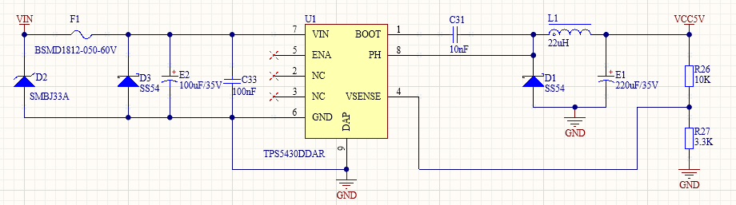
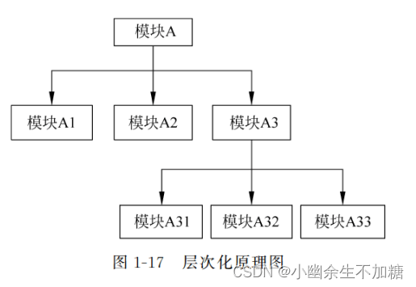
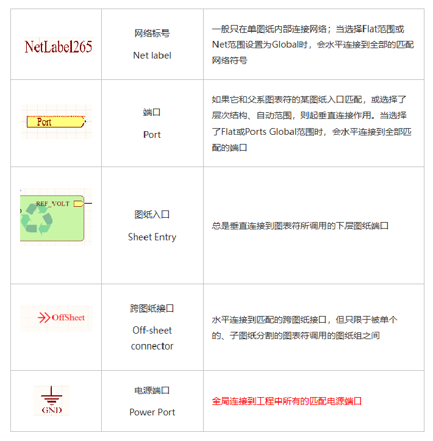
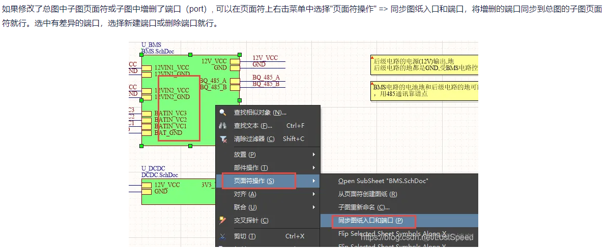
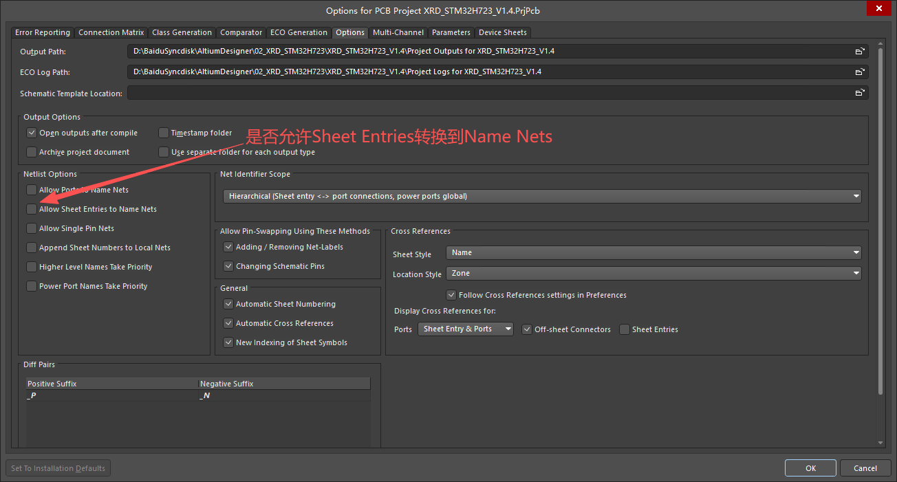

对于大规模的电路系统，需要将其按功能分解为若干个电路模块，用户可以单独绘制好各个功能模块，再将它们组合起来继续处理，最终完成整体电路的连接。

## 1 图纸结构

- **平行结构**：采用水平分割的方式，将总体的电路进行模块划分,各模块之间一般通过“离图连接器offsheet”或者具有全局连接属性的网络标号来完成电气连接。

- **层次结构**：采用垂直方向分割，将总电路以模块划分后,原理图之间一般通过Port或者全局属性的网络标号来完成电气连接。

## 2 各类网络标识符

Net Identifier Scope：用来判断不同Sheet之间的信号是否相互连通的规则。

- **自动模式**：Automatic（Based on project contents），AD 自动分析工程结构决定使用Hierarchical或者Flat。

- **扁平结构**：Flat（Only ports global）端口全局，所有Port（端口）都是全局的，只要两个 Sheet 使用同名 Port → 就是同一个 Net。不需要 Sheet Symbol / Sheet Entry。

- **层级结构**：Hierarchical（Sheet entry ↔ port connections, power ports global），这是最常用的工程结构，尤其是多层/模块化设计。
    
    - Sheet Entry ↔ Port 必须匹配名字才能互相连线
    
    - Power Port（电源端）依然是全局的（全工程共享）
    
    - 如果Sheet Entry没有连接到对应Port，这个Port不会自动变全局共享（除Power外）
    
- **严格层级**：Strict Hierarchical

    - Sheet Entry ↔ Port 必须一一对应
    
    - Power Port 变成本地（Local），不再是全局
    
    - 跨 Sheet 名字相同也不会自动连接
    
    - 必须通过层级结构明确指定连接

- **全局模式**： Global（Netlabels and ports global），所有的Net Label，Port，Power Port都是全局的（Flat），全工程中名称相同 → 自动连一起，不需要层级，Sheet Entry完全无意义。

## 2 层次结构

