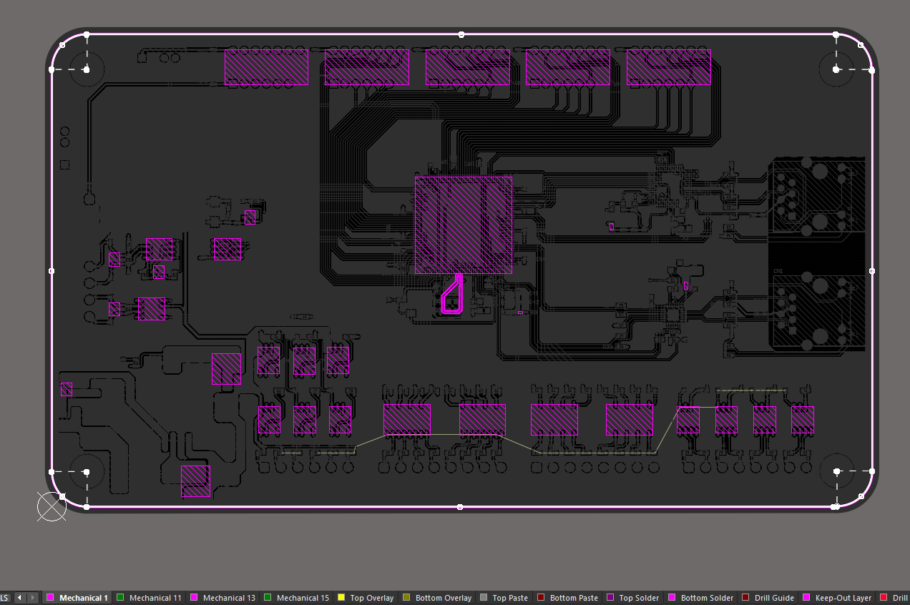
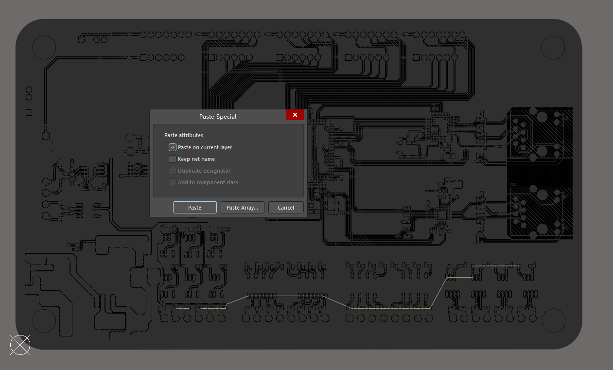
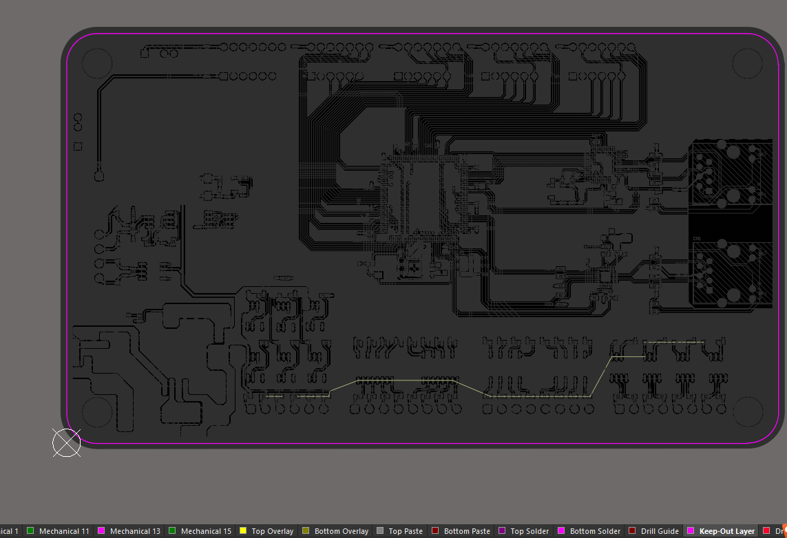
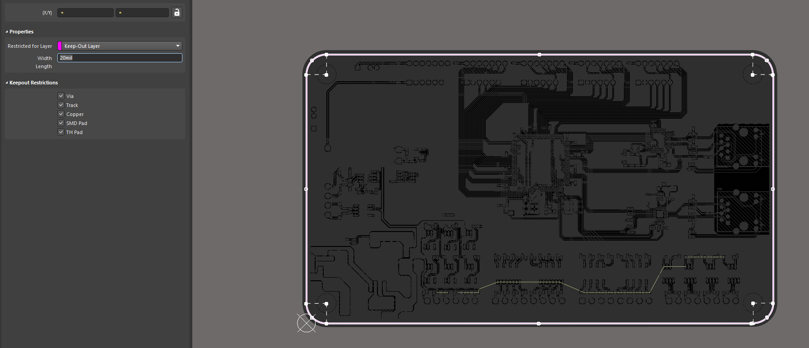
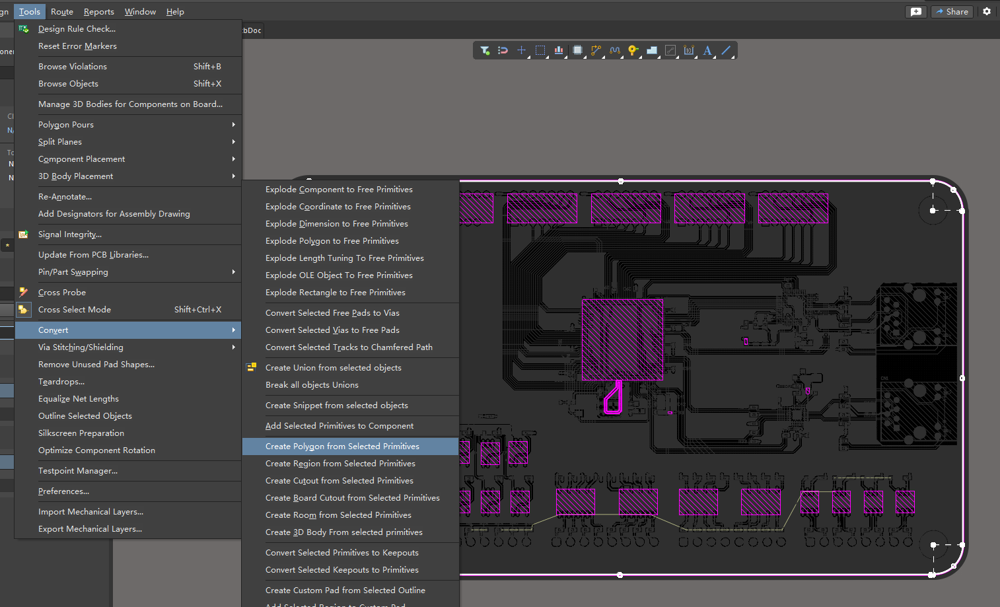
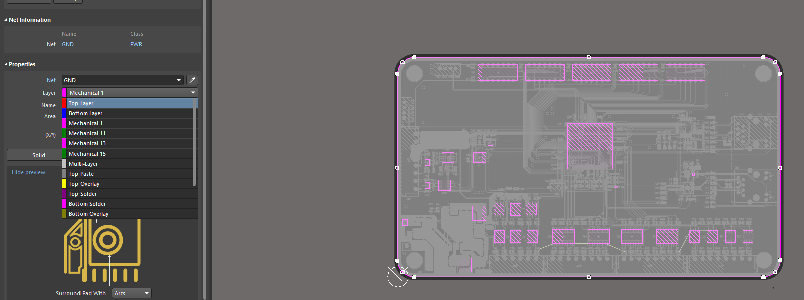
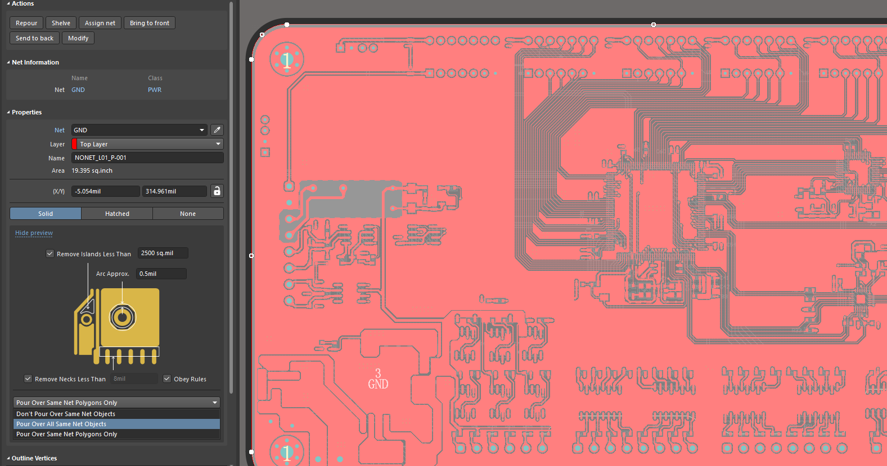

## 1 PCB整块铺铜

1. 选择机械1层，选着板子外形

    

2. EA特殊性粘贴到Keep-Out Layer

    

    可以适当调大一些禁止布线层的线宽（后续整块铺铜可以防止边框附近铺铜）

    

    

3. 机械1层，选择板子外形，工具 -> 转换 -> 从选择对象铺铜

    

4. 修改铺铜网络和铺铜层到顶层

    

5. 修改铺铜到所有网络对象

    

## 2 

缝合孔

那些器件静止铺铜