## 1 为什么拼版

电路板设计完以后需要上SMT贴片流水线贴上元器件，每个SMT的加工工厂都会根据流水线的加工要求，规定电路板的最合适的尺寸规定，比如尺寸太小或者太大，流水线上固定电路板的工装就没法固定。那么问题来了，如果我们的电路板本身尺寸小于工厂给的尺寸规定时怎么办？那就是需要我们把电路板拼板，把多个电路板拼成一整块。拼版无论对于高速贴片机还是对于波峰焊都能显著提高效率。

## 2 MARK点

mark点也叫基准点，也叫光学定位点，是贴片机使用时的定位点。由于PCB在大批量生产中为装配过程中的所有步骤提供了共同的可测量点，因此装配中使用的每个设备都可以准确定位电路图案以实现精度，通过mark点程序员就可以在加载程序后自动设置机器。

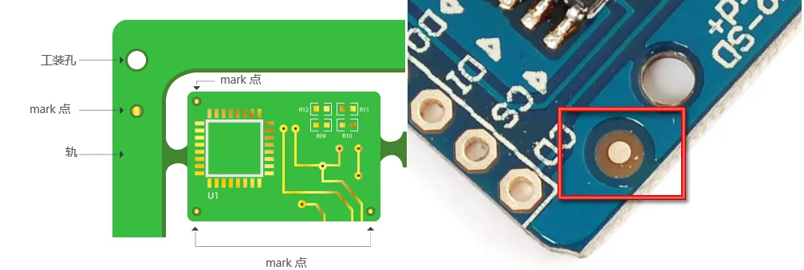

mark点尺寸一般设置直接1mm，开窗2mm。

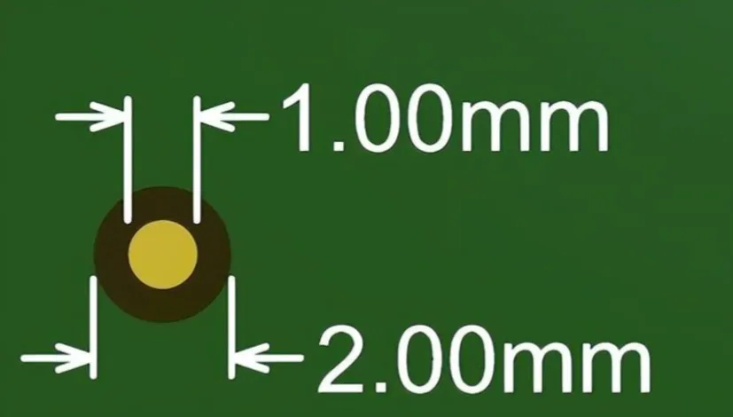

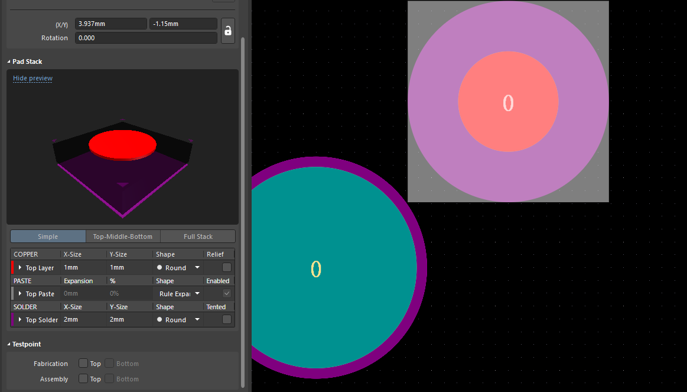

边缘距离避免将基准点靠在 PCB 的边缘，贴装机械通常使用夹具在组装期间将 PCB 锁定到位。如果夹具覆盖了基准点，则问题很严重。可以将基准标记置于距边缘至少 3 毫米的中心位置（建议 5 毫米，可以消除这些风险）

嘉立创一般设置工艺边5mm，mark点距离边缘是3.85mm左右。

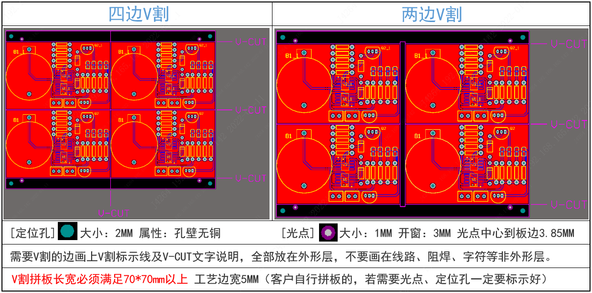

## 3 工艺边

在PCB设计领域，工艺边是一个看似简单却直接影响生产成败的重要概念。就像相框需要留出装裱边缘，PCB生产也需要预留特殊加工区域。今天我们就用生活中的例子，轻松理解这个专业概念。

想象裁缝做衣服时，会在布料边缘多留出2cm的缝份。PCB工艺边就是电路板四周多出来的"空白边"，通常宽度在3-10mm之间。这个区域虽然不安装任何电子元件，但承载着三大关键作用：

1. 传送轨道：如同火车需要轨道，SMT贴片机的传送带需要夹住工艺边来运输电路板。

2. 定位基准：像手机摄像头需要对焦标记，工艺边上的定位孔帮助机器精准对齐。

3.  加工缓冲区：V-CUT分板机切割时，需要预留操作空间防止损伤电路。

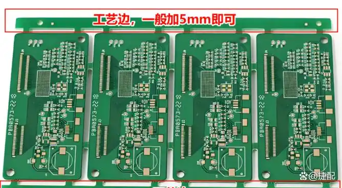

## 4 固定孔

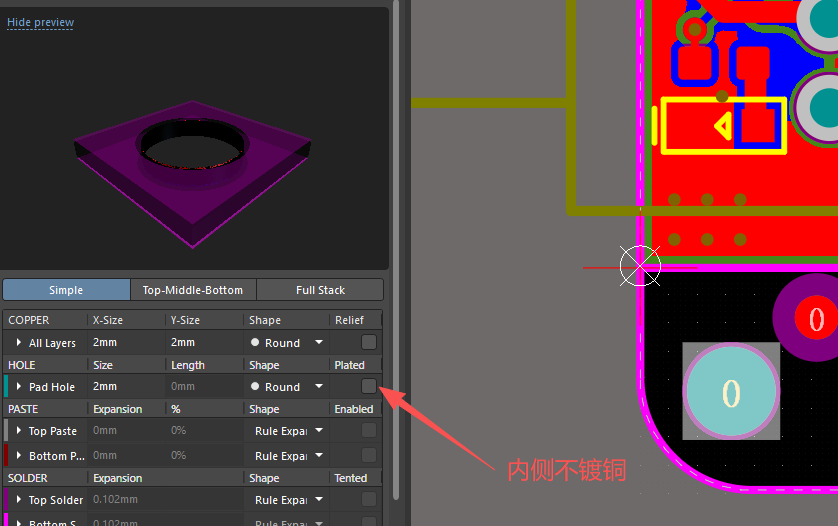

## 5 V-CUT拼版

常规V割拼版设置板与板之间的间隙为0。（不需要V割采用锣空的，两板之间的间隙为1.6MM或2MM）。

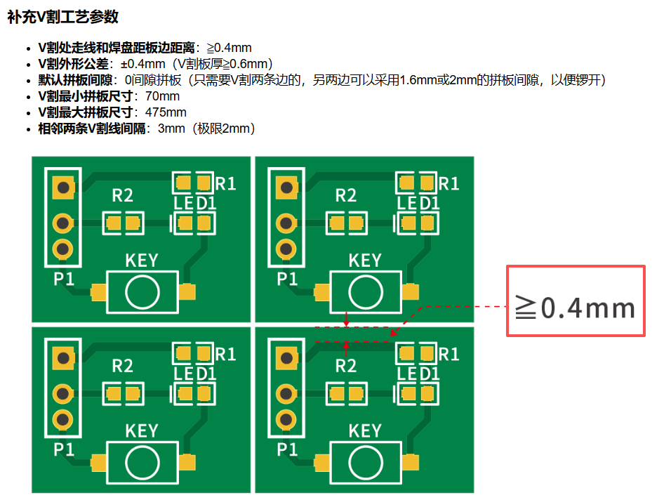

1. 新建一个PCB，保存在工程里面。

2. 快捷键P->M（拼版阵列），后会出现绿色的放置标志；

    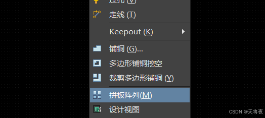

    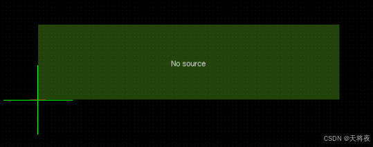

3. 此时按住TAB键，在右侧弹出设置卡，点击Properties中的PCB Document，去选择需要拼版的PCB，column count以及row count都是设置拼版个数的值，几行几列；
    
    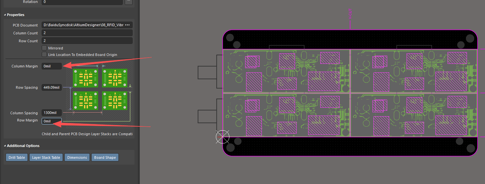

4. 绘制工艺边（5mm），放置mark点（直径1mm，开窗2mm），放置定位孔（2mm）。根据机械层，重新绘制板框。

## 6 邮票孔拼版

常规的拼板方式是V割拼板，但是对于异形板或是特别要求（如嘉立创经济型SMT贴片）等需要采用邮票孔拼板，邮票孔从文字上面看与信封上贴的邮票类似，在PCB拼板采用此方式连接的称为“邮票孔拼板”或“邮票孔连接”。

1. 邮票孔大小：建议5至8个直径0.60mm的无铜孔为一组（不建议邮票孔个数少于5）

2. 邮票孔间隙：孔边到孔边0.35-0.4MM的间隙，至少要保证0.3mm的间隙以保证有足够的连接强度（板越薄需适当加大间隙）。

3. 邮票孔位置：加在板框线的中心线或伸到板内1/3处 ，如板边有过孔、线路、安装孔及伸出元器件尽量避开。

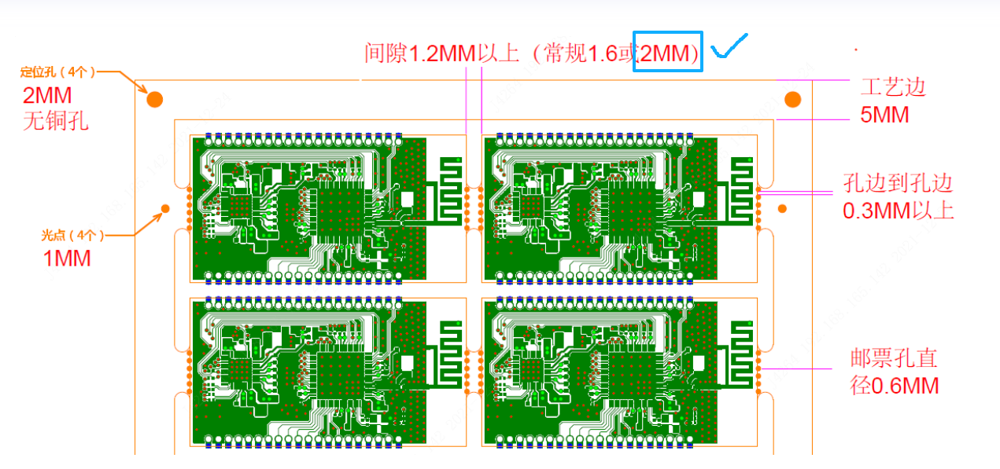

## 参考

[参考1：嘉立创PCB打样工艺——V割拼版介绍](https://www.jlc.com/portal/q7i50227.html)

[参考2： AD20如何进行V-cut拼版](https://blog.csdn.net/qq_45583758/article/details/141721442)

[参考3： 技术指导：邮票孔拼板制作规范](https://www.jlc.com/portal/server_guide_10181.html)

[参考4： AD20如何邮票孔拼版，V割拼版，添加工艺边、Mark点](https://www.bilibili.com/video/BV1s5411u7Gd/?spm_id_from=333.337.search-card.all.click&vd_source=e6b01e2e688ed9241677df121e4b897a)

[参考5： 10分钟学会Altium designer 19 pcb拼板](https://www.bilibili.com/video/BV12x411d7NZ/?spm_id_from=333.337.search-card.all.click&vd_source=e6b01e2e688ed9241677df121e4b897a)

[参考6： Altium Design PCB拼板完整教程，这样讲就明白了！](https://www.bilibili.com/opus/507389444741492819)