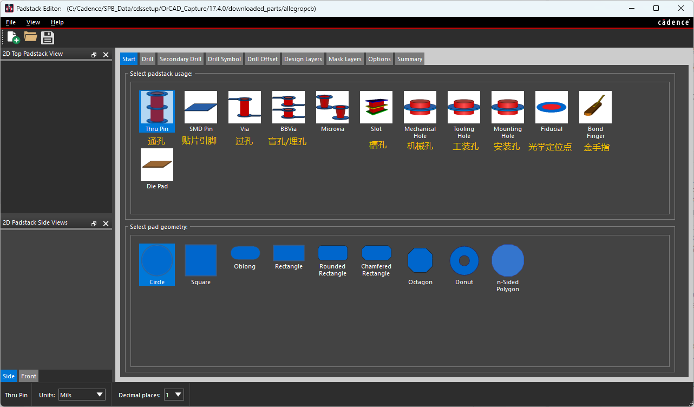
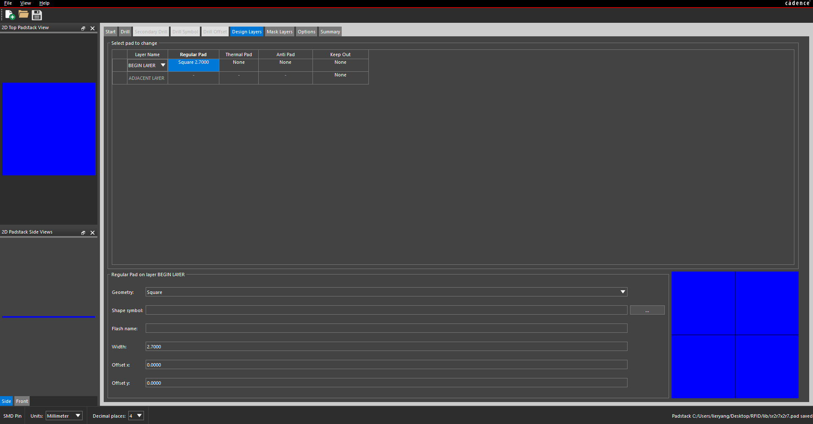
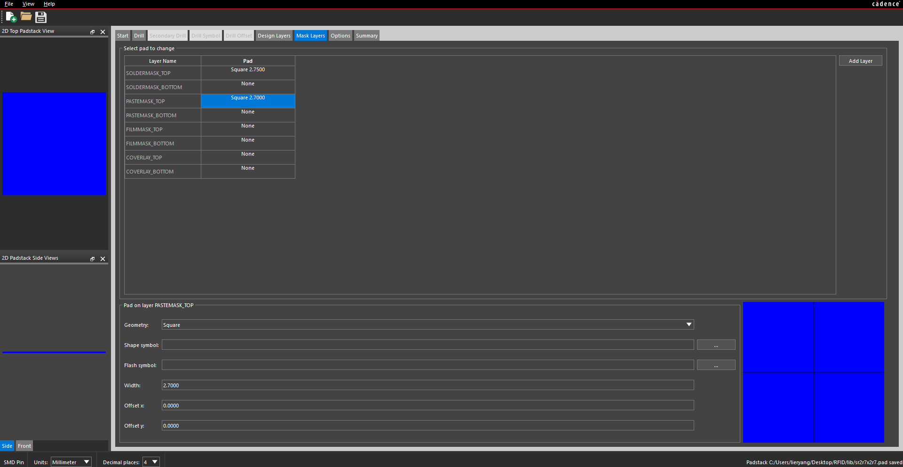

## 1 焊盘创建

焊盘（Padstack）是 PCB 封装的基础单元，使用 Cadence 的 **Padstack Editor（焊盘栈编辑器）** 创建，文件扩展名为 `.pad`。



上图是 Padstack Editor 的启动界面（**Start** 标签页），分为“焊盘用途”和“焊盘几何形状”两部分。

### 焊盘用途（Select padstack usage）

决定焊盘属于哪一类，直接影响焊盘栈的基本结构（是否打孔、是否贯穿等）。

| 名称 | 含义 |
|------|------|
| Thru Pin | 通孔引脚，孔贯穿整块板（DIP、排针等插件元件） |
| SMD Pin | 贴片引脚，只在表层，不打孔（贴片电阻、电容、IC） |
| Via | 过孔，用于层间信号连接，不放元件 |
| BBVia | 盲孔/埋孔（Blind/Buried Via），只连接部分内层，不贯穿整板 |
| Microvia | 微过孔，HDI 板用的极小激光孔 |
| Slot | 槽孔，长条形孔（异形引脚、大电流端子） |
| Mechanical Hole | 机械孔，非电气用途（定位、工艺） |
| Tooling Hole | 工装孔，生产装配用的定位/夹具孔 |
| Mounting Hole | 安装孔，用螺丝固定板子（可带铜环接地） |
| Fiducial | 光学定位点（基准点），贴片机视觉识别对位用 |
| Bond Finger | 邦定引线焊盘，芯片打线（wire bonding）用的长条焊盘 |
| Die Pad | 裸芯片焊盘，裸 Die 直接贴装用 |

### 焊盘几何形状（Select pad geometry）

决定焊盘的外形轮廓。

| 名称 | 含义 |
|------|------|
| Circle | 圆形 |
| Square | 正方形 |
| Oblong | 长圆形（两端半圆，跑道形） |
| Rectangle | 矩形 |
| Rounded Rectangle | 圆角矩形 |
| Chamfered Rectangle | 切角矩形 |
| Octagon | 八边形 |
| Donut | 圆环形（中间空） |
| n-Sided Polygon | 任意 N 边多边形 |

底部状态栏还可设置 **Units（单位，Mils/Millimeter）** 和 **Decimal places（小数位数）**。

### 常见用法举例

- 插件封装（如排针）：`Thru Pin` + `Circle` 或 `Square`（1 脚常用方形做标识）
- 贴片封装（如 0805 电阻）：`SMD Pin` + `Rectangle` 或 `Rounded Rectangle`
- 过孔：`Via` + `Circle`

### 焊盘命名规则

Padstack 没有强制命名规则，但建议遵循“形状 + 尺寸 + 孔径”的约定，让人从名字就能读出关键参数。

- **不能用小数点**：文件名里 `.` 是扩展名分隔符，小数用 `P` 或 `_` 代替（`0.5mm` → `0P5`）
- **单位统一**：全库统一 mil 或 mm，不要混用
- **不用特殊字符和空格**：只用字母、数字、下划线
- **孔径指成品孔径**

常用缩写：`CIR`/`C` 圆形、`SQ` 方形、`OBL` 长圆形、`RECT` 矩形、`OCT` 八边形；`D` 钻孔径、`PTH` 金属化孔、`NPTH` 非金属化孔。

示例：

```
通孔：  PAD62CIR38D   圆形焊盘外径 62mil，钻孔 38mil
贴片：  SMD60X40      矩形贴片焊盘 60mil × 40mil
```

## 1.1 表贴焊盘

### Design Layers（设计层）



**Design Layers** 标签页定义焊盘在 PCB 各铜层上的形状。

#### 行：层的垂直定义

一个通孔焊盘穿过整块板，在不同层上的形状可以不同，所以要分层设置。

| 层名 | 含义 |
|------|------|
| BEGIN LAYER | 起始层，焊盘栈的顶层（Top，第一层铜） |
| END LAYER | 结束层，焊盘栈的底层（Bottom，最后一层铜） |
| ADJACENT LAYER | 相邻/内层，顶底之间的所有内电层，用一行统一代表 |

> BEGIN 是最上面那层、END 是最下面那层，中间所有内层由 ADJACENT 统一控制。
> 由于表贴焊盘只在单层，一般只有 BEGIN LAYER 有实际焊盘，其它层为 None。

#### 列：四种 Pad 类型

| 名称 | 含义 |
|------|------|
| Regular Pad | 常规焊盘，实际连接元件引脚、走线连过来的那块铜 |
| Thermal Pad | 热焊盘（花焊盘），用于负片内电层，以辐条状连接铜平面，散热可控、便于焊接 |
| Anti Pad | 隔离盘（反焊盘），用于负片内电层，在平面上挖比焊盘更大的空洞，隔离不需连接的焊盘防短路 |
| Keep Out | 禁布区，该区域内禁止布线、放置其它铜或元件，保证安全间距 |

**Thermal / Anti Pad 直观理解**：内层是一大片地平面，焊盘穿过它——要连地用 **Thermal Pad**（花瓣连接），不连地用 **Anti Pad**（挖空隔离）。这两个只在内电层用负片方式绘制时才有意义，SMD 焊盘一般都是 None。

### Mask Layers（掩膜层）



**Mask Layers** 标签页定义的不是铜层，而是生产时几种“开窗/开孔”的工艺层，每层分 TOP（顶面）和 BOTTOM（底面）。

| 层名 | 含义 |
|------|------|
| SOLDERMASK TOP/BOTTOM | 阻焊（绿油）开窗，焊盘位置露铜方便焊接 |
| PASTEMASK TOP/BOTTOM | 钢网（锡膏）开孔，SMT 印刷锡膏用，仅对贴片焊盘有意义 |
| FILMMASK TOP/BOTTOM | 菲林/胶片掩膜，生产制版参考，通常留 None |
| COVERLAY TOP/BOTTOM | 覆盖膜，柔性板（FPC）专用，硬板留 None |

#### 三个关键概念

1. **SOLDERMASK（阻焊开窗）**：开窗一般比铜焊盘大一点（单边约 0.05mm，叫阻焊扩展），防止绿油盖到焊盘边缘。
2. **PASTEMASK（锡膏开孔）**：只对 SMD 焊盘有意义，通孔不需要。开孔一般等于或略小于铜焊盘，控制上锡量防桥连。
3. **COVERLAY（覆盖膜）**：只对软板/软硬结合板有意义，硬板用不到。

#### 本例参数

一个规范的顶面贴片焊盘设置：

- 铜焊盘（Regular Pad）：Square 2.7mm
- 阻焊开窗（SOLDERMASK TOP）：Square 2.75mm（比铜大 0.05mm）
- 锡膏开孔（PASTEMASK TOP）：Square 2.7mm（与铜 1:1）
- 其余 BOTTOM、FILMMASK、COVERLAY 均为 None
