## 1 焊盘创建

焊盘（Padstack）是 PCB 封装的基础单元，使用 Cadence 的 **Padstack Editor（焊盘栈编辑器）** 创建，文件扩展名为 `.pad`。

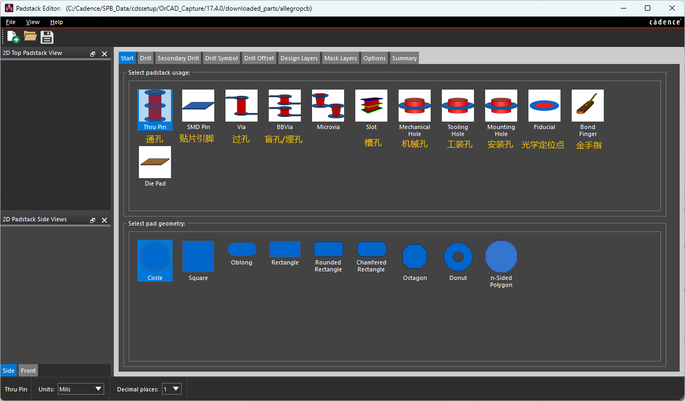

上图是 Padstack Editor 的启动界面（**Start** 标签页），分为“焊盘用途”和“焊盘几何形状”两部分。

### 焊盘用途（Select padstack usage）

决定焊盘属于哪一类，直接影响焊盘栈的基本结构（是否打孔、是否贯穿等）。

| 名称 | 含义 |
|------|------|
| Thru Pin | 通孔引脚，孔贯穿整块板（DIP、排针等插件元件） |
| SMD Pin | 贴片引脚，只在表层，不打孔（贴片电阻、电容、IC） |
| Via | 过孔，用于层间信号连接，不放元件 |
| BBVia | 盲孔/埋孔（Blind/Buried Via），只连接部分内层，不贯穿整板 |
| Microvia | 微过孔，HDI 板用的极小激光孔 |
| Slot | 槽孔，长条形孔（异形引脚、大电流端子） |
| Mechanical Hole | 机械孔，非电气用途（定位、工艺） |
| Tooling Hole | 工装孔，生产装配用的定位/夹具孔 |
| Mounting Hole | 安装孔，用螺丝固定板子（可带铜环接地） |
| Fiducial | 光学定位点（基准点），贴片机视觉识别对位用 |
| Bond Finger | 邦定引线焊盘，芯片打线（wire bonding）用的长条焊盘 |
| Die Pad | 裸芯片焊盘，裸 Die 直接贴装用 |

### 焊盘几何形状（Select pad geometry）

决定焊盘的外形轮廓。

| 名称 | 含义 |
|------|------|
| Circle | 圆形 |
| Square | 正方形 |
| Oblong | 长圆形（两端半圆，跑道形） |
| Rectangle | 矩形 |
| Rounded Rectangle | 圆角矩形 |
| Chamfered Rectangle | 切角矩形 |
| Octagon | 八边形 |
| Donut | 圆环形（中间空） |
| n-Sided Polygon | 任意 N 边多边形 |

底部状态栏还可设置 **Units（单位，Mils/Millimeter）** 和 **Decimal places（小数位数）**。

### 常见用法举例

- 插件封装（如排针）：`Thru Pin` + `Circle` 或 `Square`（1 脚常用方形做标识）
- 贴片封装（如 0805 电阻）：`SMD Pin` + `Rectangle` 或 `Rounded Rectangle`
- 过孔：`Via` + `Circle`

### 焊盘命名规则

Padstack 没有强制命名规则，但建议遵循“形状 + 尺寸 + 孔径”的约定，让人从名字就能读出关键参数。

- **不能用小数点**：文件名里 `.` 是扩展名分隔符，小数用 `P` 或 `_` 代替（`0.5mm` → `0P5`）
- **单位统一**：全库统一 mil 或 mm，不要混用
- **不用特殊字符和空格**：只用字母、数字、下划线
- **孔径指成品孔径**

#### 形状缩写

| 缩写 | 形状 | 缩写 | 形状 |
|------|------|------|------|
| `CIR` / `C` | 圆形 Circle | `RRECT` | 圆角矩形 Rounded Rectangle |
| `SQ` | 方形 Square | `CRECT` | 切角矩形 Chamfered Rectangle |
| `RECT` / `R` | 矩形 Rectangle | `OCT` | 八边形 Octagon |
| `OBL` / `OB` | 长圆形 Oblong | `DON` | 圆环形 Donut |
| `POLY` / `NP` | N 边多边形 n-Sided Polygon | | |

#### 焊盘类型 / 孔缩写

| 缩写 | 含义 | 缩写 | 含义 |
|------|------|------|------|
| `PAD` | 通孔焊盘 Thru Pin | `SMD` / `SM` | 表贴焊盘 SMD Pin |
| `VIA` / `V` | 过孔 Via | `BVIA` | 盲孔 Blind Via |
| `BUVIA` | 埋孔 Buried Via | `UVIA` / `MV` | 微过孔 Microvia |
| `MTG` | 安装孔 Mounting Hole | `TOOL` | 工装孔 Tooling Hole |
| `FID` | 基准点 Fiducial | `SLOT` | 槽孔 Slot |
| `D` | 钻孔径 Drill | `PTH` | 金属化孔（镀铜） |
| `NPTH` | 非金属化孔（不镀） | `P` / `N` | Plated 镀 / Non-plated 不镀 |

#### 命名示例

**通孔焊盘**（`PAD` + 形状 + 焊盘尺寸 + `D` + 孔径）：

```
PAD62CIR38D      圆形焊盘外径 62mil，钻孔 38mil
PAD100SQ60D      方形焊盘 100mil，钻孔 60mil（常用于插件 1 脚标识）
PAD80OBL40D      长圆形焊盘 80mil，钻孔 40mil
```

**过孔**（`VIA` + 焊盘尺寸 + `D` + 孔径）：

```
VIA24CIR10D      圆形过孔盘 24mil，孔 10mil
VIA20C10D        简写形式，盘 20mil、孔 10mil
```

**表贴焊盘**（`SMD` + 形状 + 长 `X` 宽）：

```
SMD60X40         矩形贴片焊盘 60mil × 40mil
SMDRRECT40X24    圆角矩形贴片焊盘 40mil × 24mil
SMD1P0X0P5       公制 1.0mm × 0.5mm（P 代替小数点）
```

**机械 / 非金属化孔**（`MTG` / `M` + `D` + 孔径 + 镀层标识）：

```
MTG125NPTH       安装孔，成品孔 125mil，不镀铜
MTG130PTH        安装孔，成品孔 130mil，镀铜（可接地）
TOOL80NPTH       工装定位孔 80mil，不镀
```

## 1.1 表贴焊盘

### Design Layers（设计层）

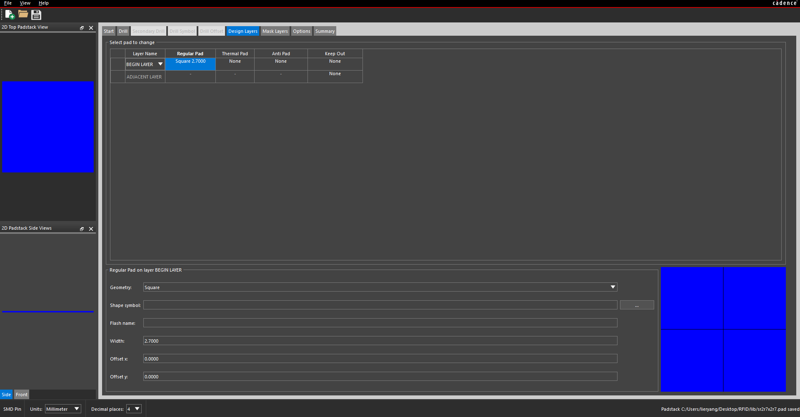

**Design Layers** 标签页定义焊盘在 PCB 各铜层上的形状。

#### 行：层的垂直定义

一个通孔焊盘穿过整块板，在不同层上的形状可以不同，所以要分层设置。

| 层名 | 含义 |
|------|------|
| BEGIN LAYER | 起始层，焊盘栈的顶层（Top，第一层铜） |
| END LAYER | 结束层，焊盘栈的底层（Bottom，最后一层铜） |
| ADJACENT LAYER | 相邻/内层，顶底之间的所有内电层，用一行统一代表 |

> BEGIN 是最上面那层、END 是最下面那层，中间所有内层由 ADJACENT 统一控制。
> 由于表贴焊盘只在单层，一般只有 BEGIN LAYER 有实际焊盘，其它层为 None。

#### 列：四种 Pad 类型

| 名称 | 含义 |
|------|------|
| Regular Pad | 常规焊盘，实际连接元件引脚、走线连过来的那块铜 |
| Thermal Pad | 热焊盘（花焊盘），用于负片内电层，以辐条状连接铜平面，散热可控、便于焊接 |
| Anti Pad | 隔离盘（反焊盘），用于负片内电层，在平面上挖比焊盘更大的空洞，隔离不需连接的焊盘防短路 |
| Keep Out | 禁布区，该区域内禁止布线、放置其它铜或元件，保证安全间距 |

**Thermal / Anti Pad 直观理解**：内层是一大片地平面，焊盘穿过它——要连地用 **Thermal Pad**（花瓣连接），不连地用 **Anti Pad**（挖空隔离）。这两个只在内电层用负片方式绘制时才有意义，SMD 焊盘一般都是 None。

### Mask Layers（掩膜层）

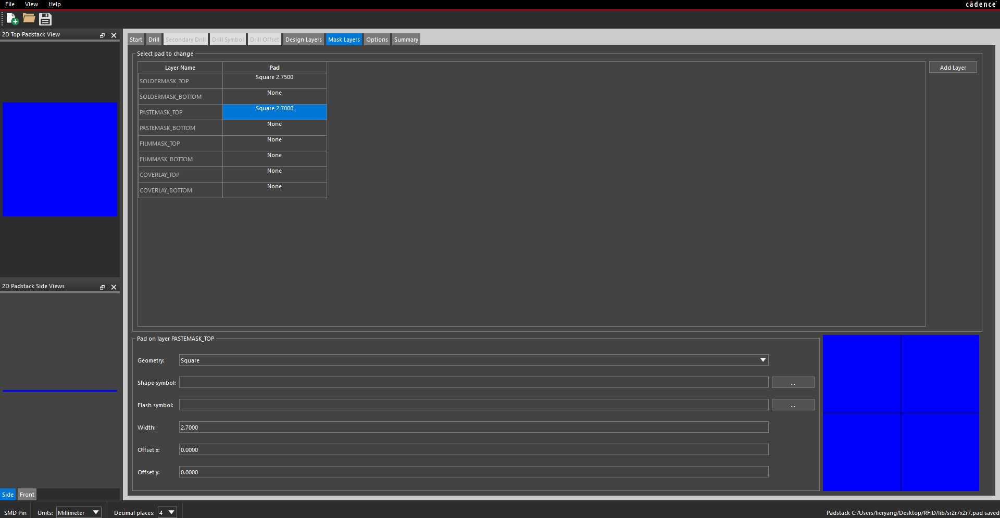

**Mask Layers** 标签页定义的不是铜层，而是生产时几种“开窗/开孔”的工艺层，每层分 TOP（顶面）和 BOTTOM（底面）。

| 层名 | 含义 |
|------|------|
| SOLDERMASK TOP/BOTTOM | 阻焊（绿油）开窗，焊盘位置露铜方便焊接 |
| PASTEMASK TOP/BOTTOM | 钢网（锡膏）开孔，SMT 印刷锡膏用，仅对贴片焊盘有意义 |
| FILMMASK TOP/BOTTOM | 菲林/胶片掩膜，生产制版参考，通常留 None |
| COVERLAY TOP/BOTTOM | 覆盖膜，柔性板（FPC）专用，硬板留 None |

#### 三个关键概念

1. **SOLDERMASK（阻焊开窗）**：开窗一般比铜焊盘大一点（单边约 0.05mm，叫阻焊扩展），防止绿油盖到焊盘边缘。
2. **PASTEMASK（锡膏开孔）**：只对 SMD 焊盘有意义，通孔不需要。开孔一般等于或略小于铜焊盘，控制上锡量防桥连。
3. **COVERLAY（覆盖膜）**：只对软板/软硬结合板有意义，硬板用不到。


新建封装

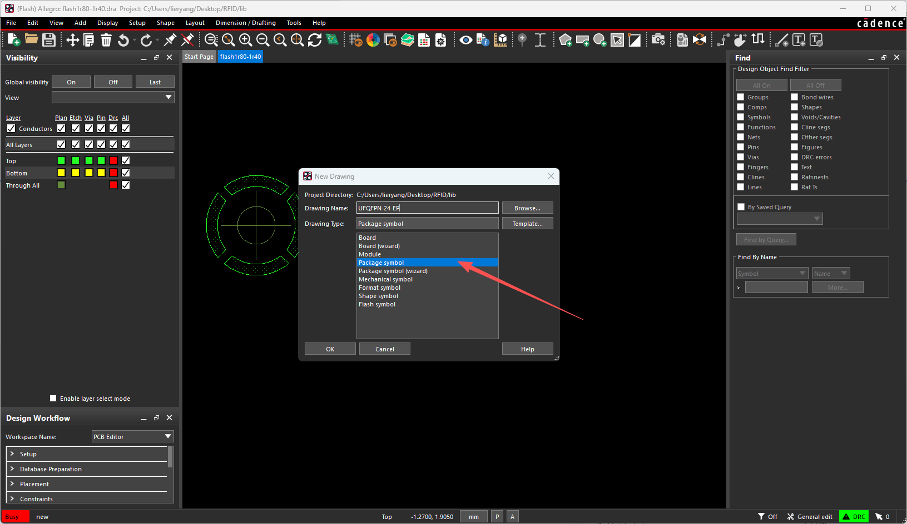

设置单位和精度，左移左下角坐标放到（-100，-100）

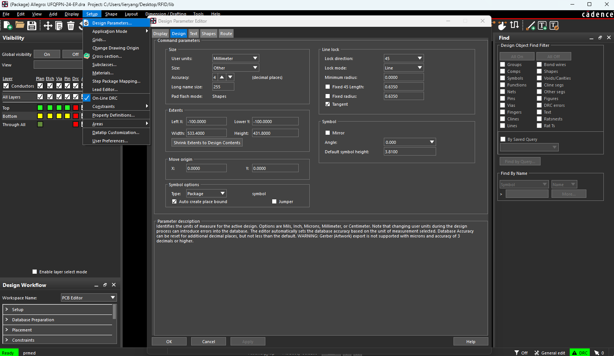

焊盘路径

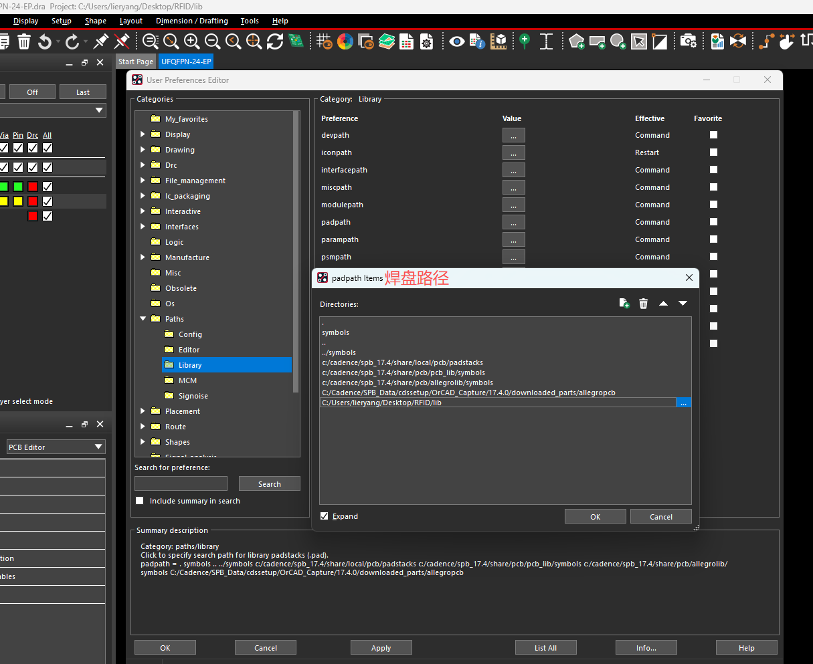

如果点击 layout -> pins 右侧没有 `Options` 就需要View里面点击 `Options`

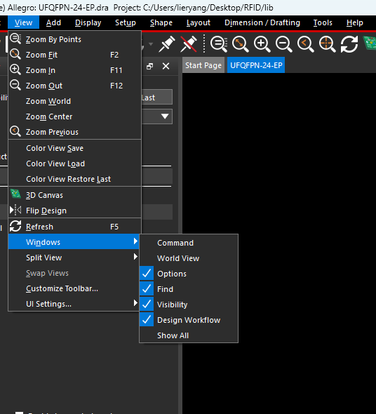

放置焊盘

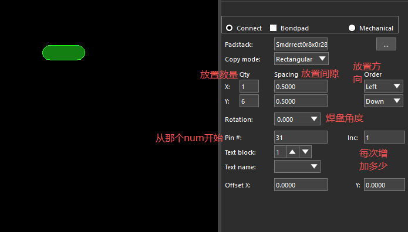

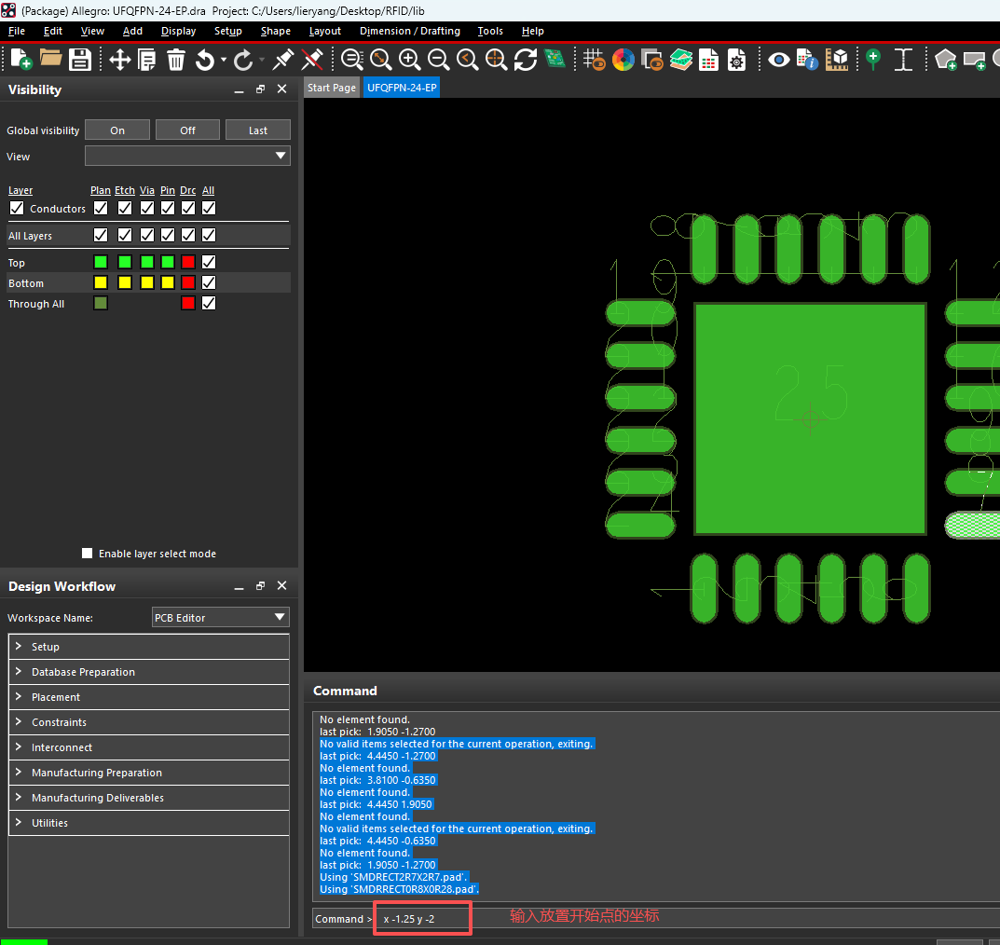

绘制装配线

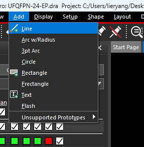

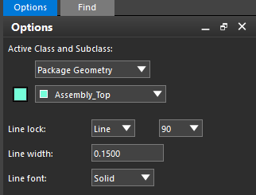

```sh
x -2 -2 //开始点位置
ix 4 //X正方向偏移增加4
iy 4 //Y正方向偏移增加4
ix -4 //X负方向偏移4
x -2 -2 //回到起点 
```

绘制丝印线

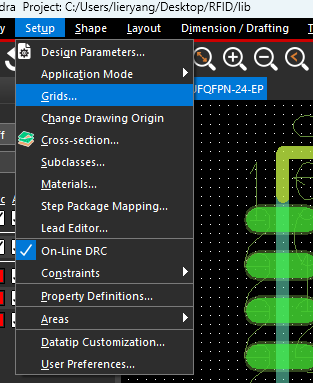

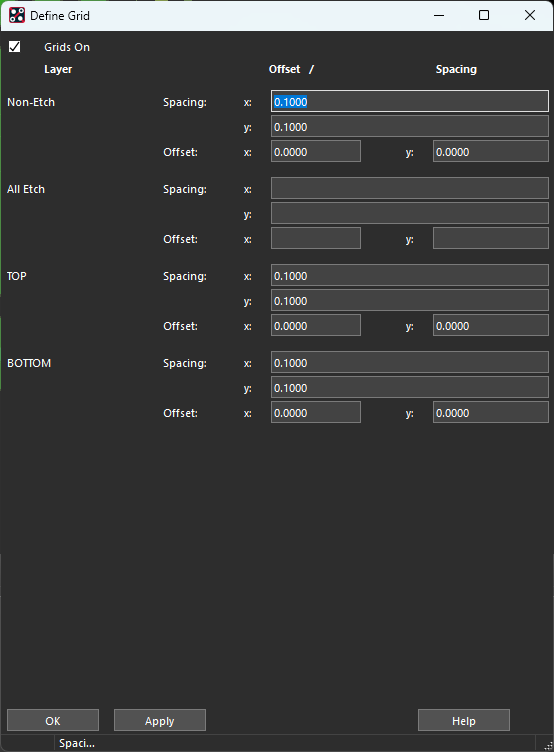

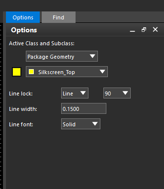

添加位号

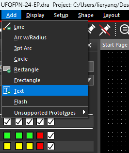

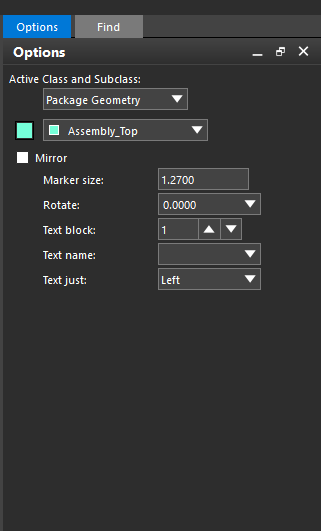

输入文本是 `#REF`   ***只放这个其实就可以***

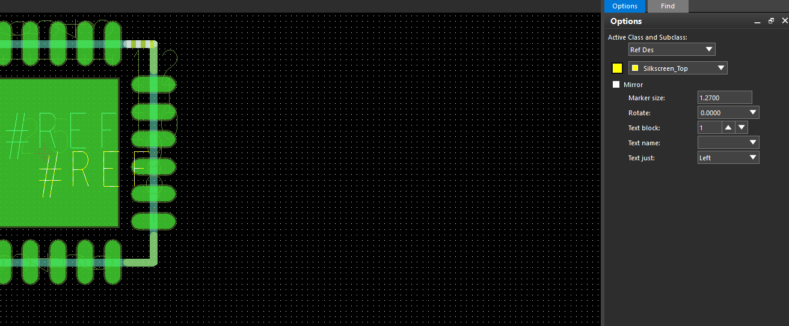

输入文本是 `#VAL`

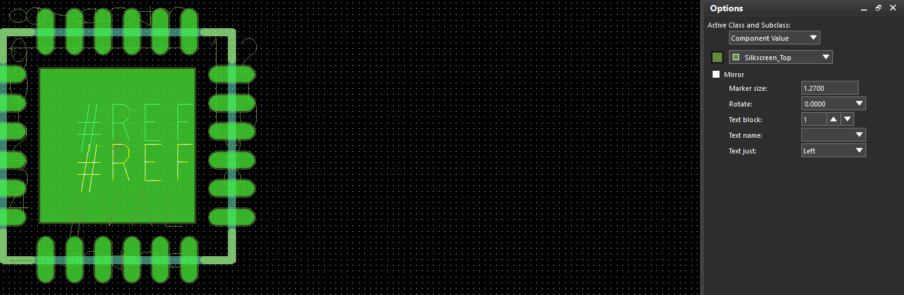

放置占地面积

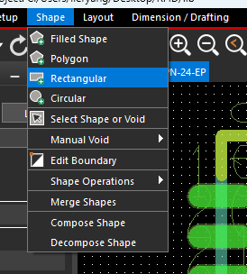

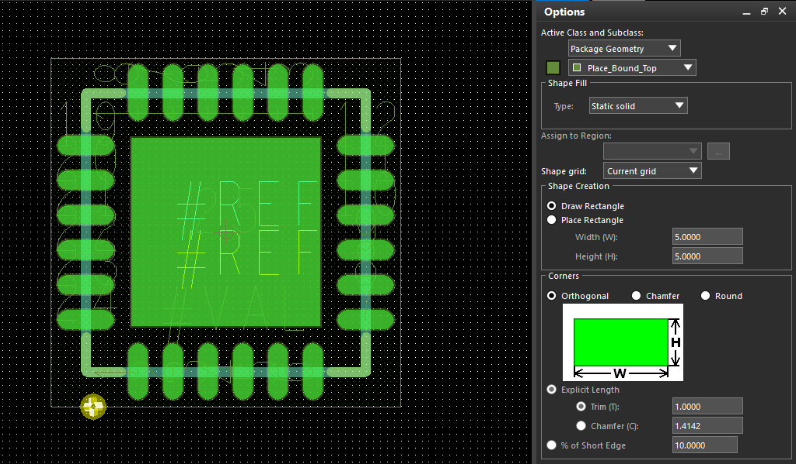

## 1.2 通孔焊盘

通孔焊盘（Thru Pin）用于插件元件（DIP、排针、连接器等），孔贯穿整块板。相比表贴焊盘，多了一步“钻孔”设置。

### Start（选择类型和形状）

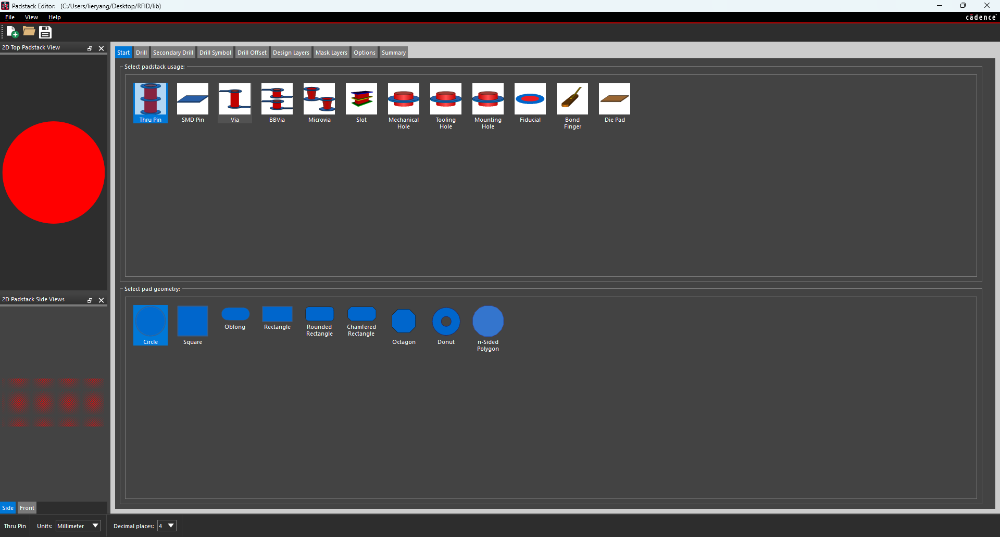

在 **Start** 标签页选择：

- 焊盘用途：**Thru Pin**（通孔引脚）
- 焊盘几何形状：**Circle**（圆形，通孔最常用；插件 1 脚常用 Square 做标识）
- 底部单位设为 **Millimeter**，小数位 4 位

### Drill（钻孔设置）

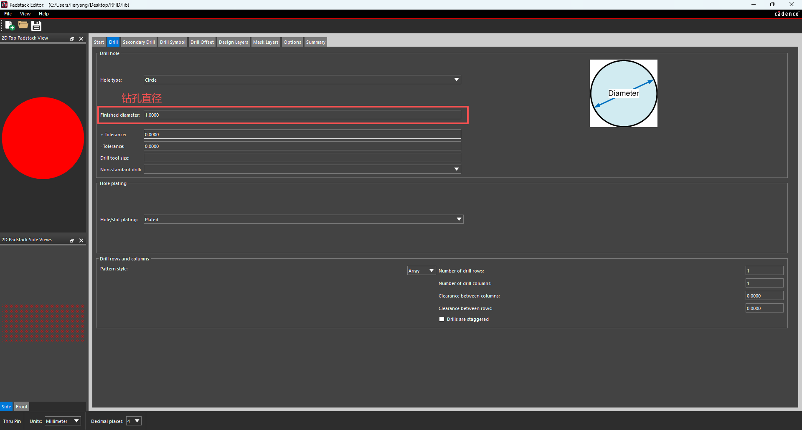

**Drill** 标签页是通孔焊盘的核心，定义孔的参数。

| 字段 | 含义 | 设置说明 |
|------|------|----------|
| Hole type | 孔形状 | 圆孔选 **Circle**；槽孔选 Oval/Slot |
| **Finished diameter** | **成品孔径（钻孔直径）** | 最关键的值，指最终成品孔的直径。填元件引脚直径 + 余量（一般单边留 0.2~0.3mm） |
| + Tolerance / - Tolerance | 上/下公差 | 孔径允许的误差范围，一般留 0 交给厂家 |
| Drill tool size | 钻头尺寸 | 通常留空，由成品孔径自动推算 |
| Non-standard drill | 非标钻孔 | 特殊孔才用，一般留空 |
| **Hole/slot plating** | **孔壁镀层** | **Plated（镀铜）**= 金属化孔，可导电互连（PTH）；Non-plated = 非金属化孔（NPTH），仅机械用途 |

底部 **Drill rows and columns** 用于一次生成孔阵列（如插座），单个引脚保持行列均为 1 即可。

> 本例：Hole type = Circle，Finished diameter = **1.0mm**，Hole plating = **Plated**（金属化通孔）。

### Drill Symbol（钻孔符号）

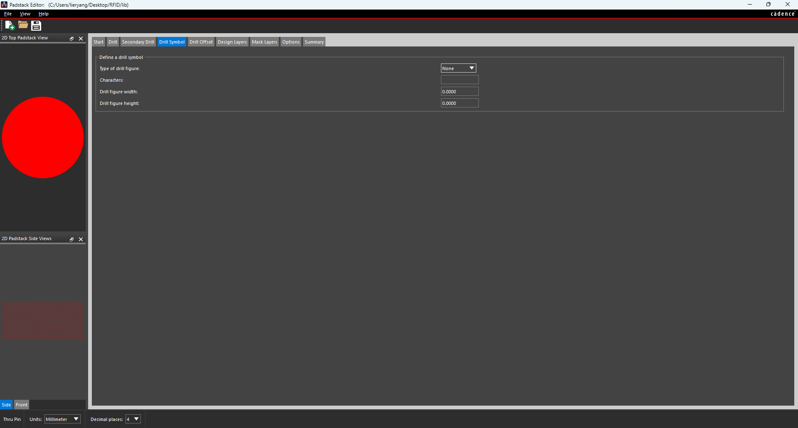

**Drill Symbol** 定义该孔在“钻孔图（Drill Legend 钻孔表）”上的标识符号，只用于制板厂看图识别孔径，**不影响焊盘的实际功能**。

| 字段 | 含义 |
|------|------|
| Type of drill figure | 符号形状（Circle / Square / Triangle / Cross 等），默认 None |
| Characters | 钻孔表里显示的索引字符（A、B、C…） |
| Drill figure width / height | 符号在图纸上的尺寸 |

**通常保持默认 `None` 即可。** 钻孔符号一般在 PCB 板级设计（Allegro PCB Editor）执行 `Manufacture → NC → Drill Legend` 时由软件自动为每种孔径分配，无需在单个焊盘里手动指定，这样也不会与其它焊盘符号冲突。


### 制作 Flash 花焊盘符号

当内电层用负片（Negative）平面时，Thermal Pad 需要一个 Flash（花焊盘）符号。这个符号不能在 Padstack Editor 里直接画，要先在 **PCB Editor** 里单独创建成 `.dra` / `.fsm` 文件，再回焊盘里引用。

#### 1. 新建 Flash symbol 图纸

打开 `PCB Editor 17.4`，`File → New`，创建一张 Flash symbol 图纸。

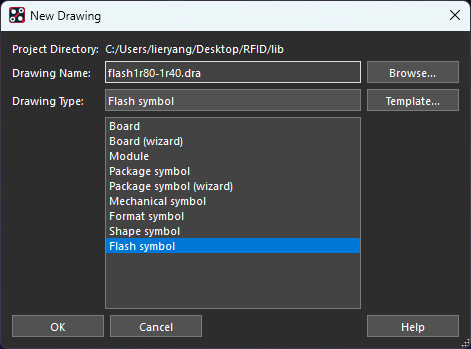

- **Drawing Name**：填符号名，例如 `flash1r80-1r40.dra`（命名体现参数：外径 1.80、内径 1.40）
- **Drawing Type**：选 **Flash symbol**
- **Project Directory**：符号保存路径，这里是 `C:/Users/lieryang/Desktop/RFID/lib`

#### 2. 设置单位和精度

`Setup → Design Parameters`，在 Parameter Editor 的 **Design** 页设置绘图单位和精度，保证和封装库一致。

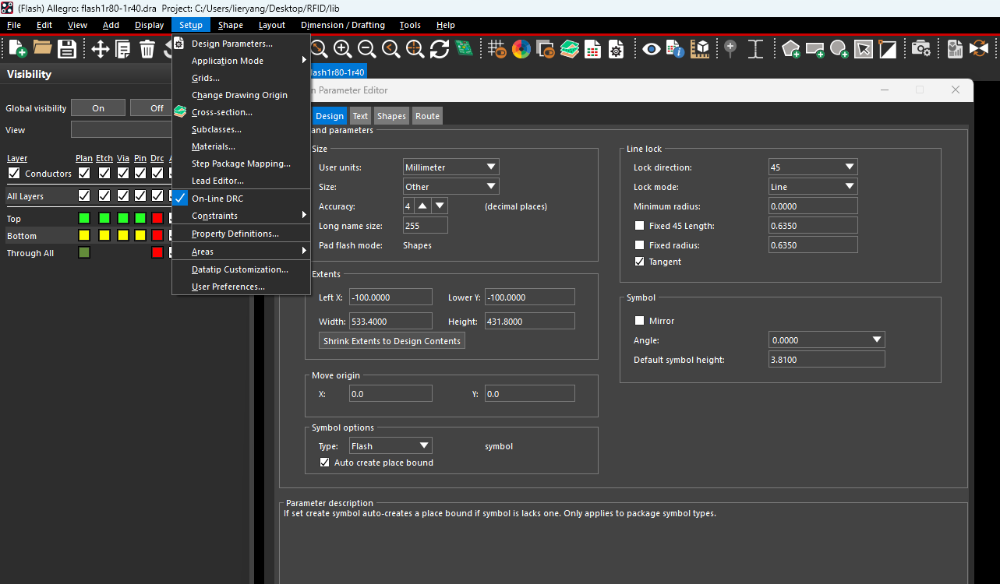

- **User units**：Millimeter（毫米）
- **Accuracy**：4（小数位数）
- Size 选 Other，其余保持默认即可

#### 3. 添加热焊盘（定义花焊盘参数）

`Add → Flash`，弹出 **Thermal Pad Symbol Defaults** 对话框，填入花焊盘的几何参数。

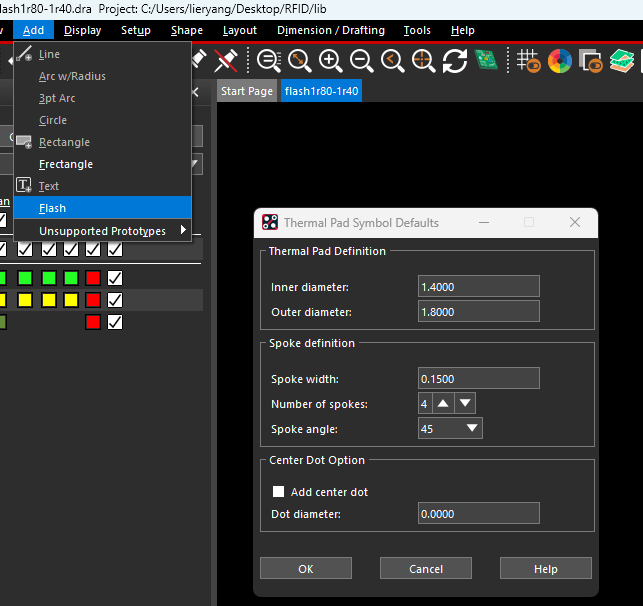

| 参数 | 含义 | 本例值 |
|------|------|--------|
| Inner diameter | 内径，中间隔离区的直径（略大于孔/焊盘） | 1.4mm |
| Outer diameter | 外径，隔离环的外缘直径 | 1.8mm |
| Spoke width | 辐条宽度，每根连接铜条的宽度 | 0.15mm |
| Number of spokes | 辐条数量，一般 4 根 | 4 |
| Spoke angle | 辐条角度，4 根时常用 45° | 45° |
| Add center dot | 是否在中心加铜点，一般不勾 | 不勾 |

填完点 OK，图纸上就生成了花焊盘图形，保存即得到 `flash1r80-1r40` 符号。

#### 4. 把符号路径加入库搜索路径

要让 Padstack Editor 能找到刚做的符号，需把符号所在目录加进 **psmpath**（库符号搜索路径）。

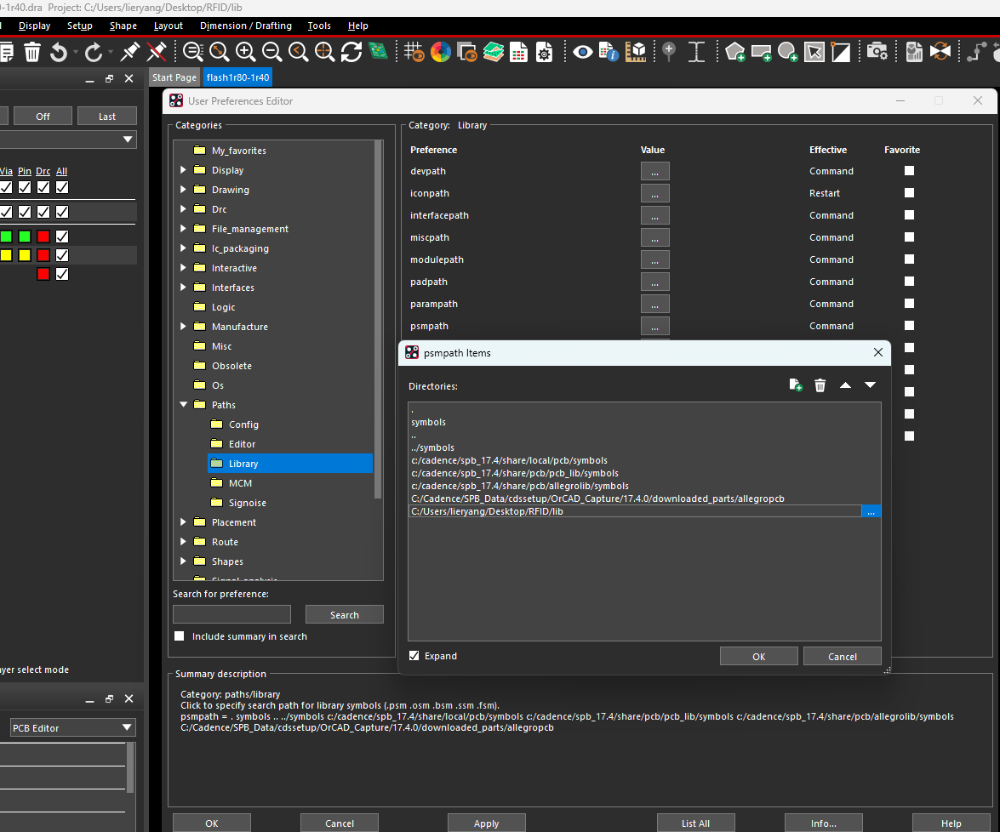

`Setup → User Preferences → Paths → Library`，找到 **psmpath**，点右侧 `...` 添加目录 `C:/Users/lieryang/Desktop/RFID/lib`，确定。这样焊盘编辑器才能在浏览器里列出这个 flash 符号。

> 提示：flash 符号属于 `.fsm`，由 `psmpath` 管理；找不到符号多半是这个路径没加对。

#### 5. 在焊盘里引用 Flash（设置 Thermal Pad）

回到 Padstack Editor 的 **Design Layers**，选中内层（DEFAULT INTERNAL）的 **Thermal Pad** 单元格，Geometry 选 **Flash**，再点 `...` 打开 Library Shape Symbol Browser，选中 `flash1r80-1r40`。

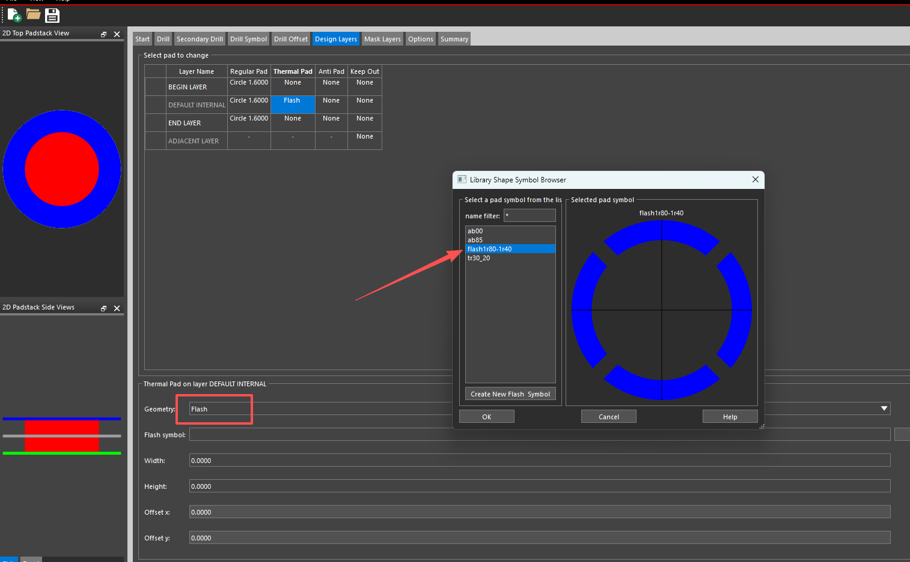

预览里蓝色断环即热焊盘图形：蓝色是隔离（挖铜），4 个缺口是连接用的铜辐条。选好点 OK，内层 Thermal Pad 就设成了这个花焊盘。

#### 6. 设置内层 Anti Pad（隔离盘）

同样在 **Design Layers**，选中内层的 **Anti Pad** 单元格。

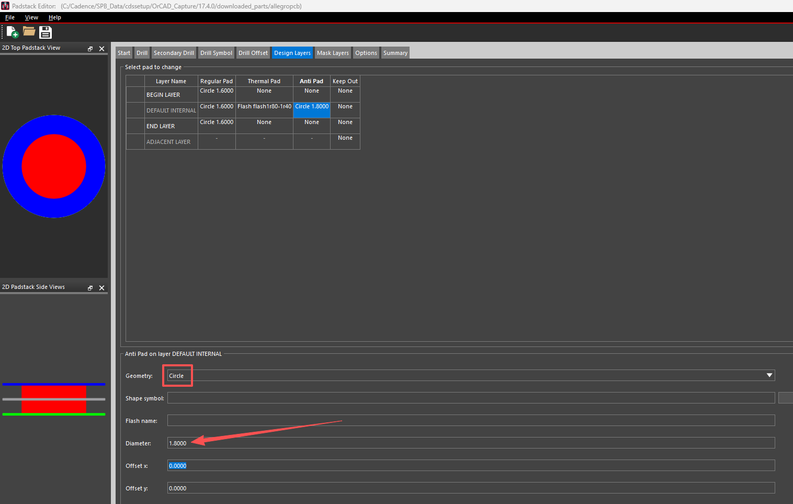

- **Geometry**：选 **Circle**
- **Diameter**：填 **1.8mm**（比 Regular Pad 大，与花焊盘外径一致，保证隔离间隙）

这样不连接的孔在内层就有了一个 1.8mm 的圆形隔离区。

#### 7. 确认 Mask Layers（掩膜层）

最后到 **Mask Layers** 检查阻焊开窗。

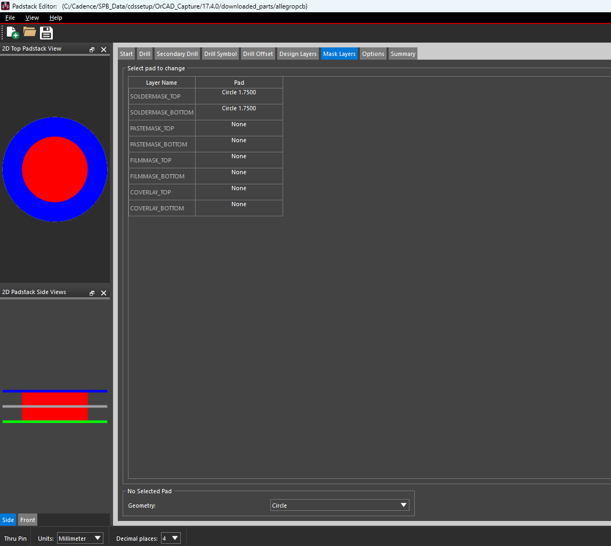

- **SOLDERMASK_TOP / BOTTOM**：Circle **1.75mm**（比铜焊盘 1.6mm 单边大约 0.075mm，做阻焊扩展）
- PASTEMASK、FILMMASK、COVERLAY 均为 None（通孔不需要钢网锡膏，硬板无覆盖膜）

至此，一个带热焊盘和隔离盘的通孔焊盘就制作完成：铜焊盘 1.6mm、孔 1.0mm、内层花焊盘 flash1r80-1r40、隔离盘 1.8mm、阻焊开窗 1.75mm。


如何修改焊盘pin number

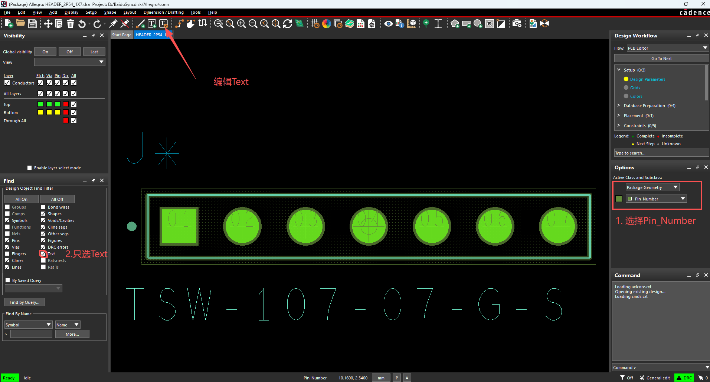