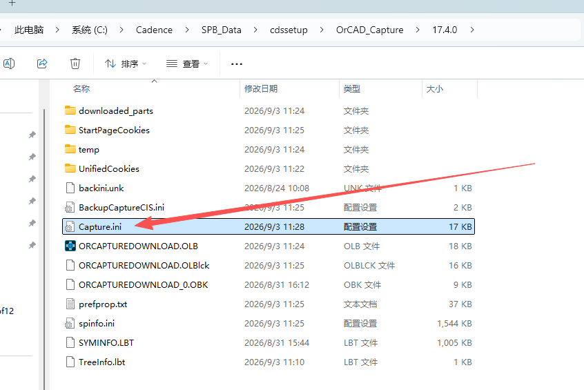
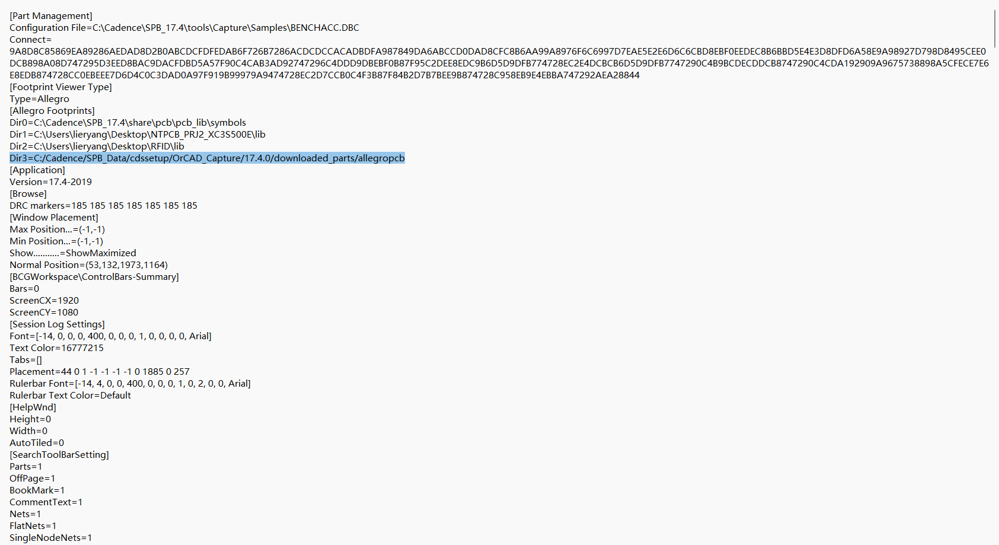

## 1 问题现象

在 OrCAD Capture 里给器件绑定了 PCB 封装后，右侧 **Footprint Viewer（封装预览）** 打不开，提示：

```
Could not launch footprint, see Capture session log for more details
```

查看 Session Log，可以看到具体报错：

```
ERROR(ORCAP-1733): Allegro footprint UFQFPN-24-EP was not found in the search path.
```

意思是：器件的 **PCB Footprint** 属性名（`UFQFPN-24-EP`）填对了，封装文件（`.dra` / `.psm`）也确实存在，但 **Capture 在它的搜索路径里找不到这个封装**。

## 2 根本原因

关键点：**OrCAD Capture 的 Footprint Viewer 不读 PCB Editor 的 `psmpath`。**

- PCB Editor（Allegro）找封装靠的是 `pcbenv/env` 里的 `psmpath` / `padpath`。
- 而 Capture 的封装预览用的是**自己独立的一份路径列表**，存在 `capture.ini` 的 `[Allegro Footprints]` 段里。

所以即使在 User Preferences 里把库目录加进了 `psmpath`、重启 Capture 也没用——因为两者是**两套互不相干的路径**。只要 `capture.ini` 里没有你的封装库目录，Capture 就永远找不到。

## 3 解决办法：编辑 capture.ini

### 3.1 找到 capture.ini

路径在：

```
C:\Cadence\SPB_Data\cdssetup\OrCAD_Capture\17.4.0\capture.ini
```



如上图，在资源管理器进入该目录，找到 `Capture.ini` 文件（配置设置类型，约 17 KB）。

> 注意：编辑前要**先完全关闭 OrCAD Capture**。因为 Capture 退出时会把内存里的配置回写 `capture.ini`，会覆盖掉手动的修改。

### 3.2 在 [Allegro Footprints] 段添加库目录

用记事本打开 `capture.ini`，找到 `[Allegro Footprints]` 段落，按 `DirN` 递增的格式添加自己的封装库目录。



如上图，`[Allegro Footprints]` 段列出了 Capture 的封装搜索目录：

```ini
[Footprint Viewer Type]
Type=Allegro
[Allegro Footprints]
Dir0=C:\Cadence\SPB_17.4\share\pcb\pcb_lib\symbols
Dir1=C:\Users\lieryang\Desktop\NTPCB_PRJ2_XC3S500E\lib
Dir2=C:\Users\lieryang\Desktop\RFID\lib
Dir3=C:/Cadence/SPB_Data/cdssetup/OrCAD_Capture/17.4.0/downloaded_parts/allegropcb
```

其中 `Dir2=C:\Users\lieryang\Desktop\RFID\lib` 就是新加的一行，指向存放 `UFQFPN-24-EP.dra` / `.psm` 的封装库目录。

添加规则：

- 每个目录一行，键名是 `Dir` + 连续序号（`Dir0`、`Dir1`、`Dir2`…），**序号不能跳号、不能重复**
- 值填封装库的绝对路径，反斜杠 `\` 或正斜杠 `/` 都可以
- 该目录下要有对应的 `.dra` / `.psm` 文件

### 3.3 保存并重启

1. 保存 `capture.ini`
2. 重新打开 OrCAD Capture、加载工程
3. Footprint Viewer 就能正常显示 `UFQFPN-24-EP` 了

## 4 小结

| 工具 | 找封装用的路径 | 配置位置 |
|------|---------------|----------|
| Allegro PCB Editor | `psmpath` / `padpath` | `pcbenv/env`（或 User Preferences） |
| **OrCAD Capture 封装预览** | **`[Allegro Footprints]`** | **`capture.ini`** |

一句话：Capture 预览封装找不到（ORCAP-1733），不是 `psmpath` 的问题，而是要在 `capture.ini` 的 `[Allegro Footprints]` 段加上封装库目录，且修改前要先关闭 Capture。
