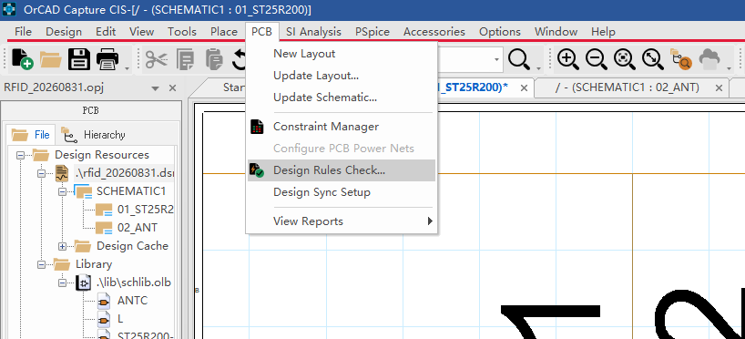
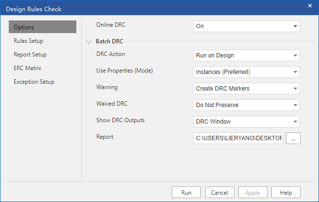
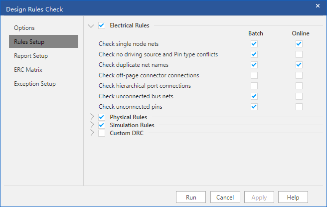
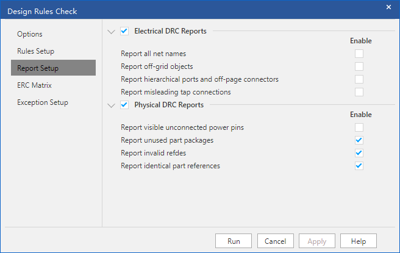

## 1 打开 DRC

在 OrCAD Capture 里打开工程后，菜单栏点 **PCB → Design Rules Check...**。

上图是 `rfid_20260831` 工程打开后的菜单。`PCB` 下拉里和板图相关的项很多，原理图检查用的就是中间那一项 **Design Rules Check...**。

同一菜单里相邻几项容易混：

| 菜单项 | 用途 |
|--------|------|
| New Layout / Update Layout | 从原理图创建或更新 PCB |
| Update Schematic | 把 PCB 侧改动回写原理图 |
| Constraint Manager | 约束管理器（线宽、间距等） |
| **Design Rules Check...** | **原理图电气/物理规则检查** |
| View Reports | 查看已生成的各类报告 |

点开后会弹出 **Design Rules Check** 对话框，左侧有五个页：Options、Rules Setup、Report Setup、ERC Matrix、Exception Setup。下面按截图把前三个页讲清楚。

## 2 Options：检查方式和输出

这是 DRC 的总开关和运行方式。左侧当前选中 **Options**。

### Online DRC

右上角 **Online DRC = On**，表示在线检查开着：画原理图时，连错线、悬空引脚会立刻在图上标出来，不用等整板跑一遍。

- `On`：边画边查，适合日常绘图
- `Off`：关掉实时检查，大图卡顿时可以先关，画完再用下面的 Batch DRC 一次查完

### Batch DRC

下面一整块是**批量检查**的配置，点对话框底部的 **Run** 才会按这些选项跑一遍。

| 选项 | 图中取值 | 含义 |
|------|----------|------|
| DRC Action | Run on Design | 对整个设计（当前工程）跑 DRC。还可以改成只查当前页、当前选中对象 |
| Use Property (Mode) | Instances (preferred) | 优先用实例属性。器件在图上放了多份时，以这颗实例自己的属性为准，而不是只看库里的 Occurrences |
| Warning | Create DRC Markers | 警告级问题也在原理图上打 DRC 标记（小圆圈/旗帜），方便从图上跳过去 |
| Waived DRC | Do Not Preserve | 以前手动“豁免”过的 DRC 不保留。重新跑时该报的还会报，避免旧豁免把新问题盖住 |
| Show DRC Output | DRC Window | 结果弹到 DRC 窗口，而不是只写文件 |
| Report | `C:\USERS\LIERYANG\DESKTOP\...` | DRC 文本报告的保存路径，可点右侧 `...` 改到工程目录 |

日常建议就按上图：**Online 开着，Batch 对整个 Design 跑，警告打标记，结果看 DRC 窗口**。路径改到自己的工程目录即可。

底部四个按钮：

- **Run**：按当前配置立刻检查
- **Apply**：只保存设置，不跑
- **Cancel**：放弃
- **Help**：帮助

## 3 Rules Setup：查哪些电气规则

左侧切到 **Rules Setup**，决定“查什么”。最上一项 **Electrical Rules** 已勾选并展开，右侧两列是 **Batch**（批量）和 **Online**（在线）。同一条规则可以只给批量开、只给在线开，或两边都开。

图中 Electrical Rules 的勾选如下：

| 规则 | Batch | Online | 查什么 |
|------|:-----:|:------:|--------|
| Check single node nets | ✓ | ✓ | 单节点网络：一根网只连了一个点，通常是漏连或网名写错 |
| Check no driving source and Pin type conflicts | ✓ | | 没有驱动源、以及引脚类型冲突（例如两个 Output 短在一起，或 Input 悬空无驱动） |
| Check duplicate net names | ✓ | ✓ | 同名网络是否被拆成多段、是否不该同名却同名 |
| Check off-page connector connections | | | 跨页连接器（Off-Page Connector）有没有成对连上。单页原理图可以不查 |
| Check hierarchical port connections | | | 层次图端口（Hierarchical Port）和子电路有没有对上。平坦原理图可以不查 |
| Check unconnected bus nets | ✓ | | 总线里有没有某根信号没真正连出去 |
| Check unconnected pins | ✓ | | 器件引脚悬空。电源脚、NC 脚如果故意不接，后面要用 ERC Matrix 或豁免处理 |

上图里 **off-page** 和 **hierarchical port** 都没勾，是因为当前 RFID 工程是平坦、少跨页的画法，这两条没有对象可查。如果原理图分页或多层次，这两条建议 Batch 打开。

下面还有三组总开关（图中未展开明细）：

| 组 | 图中状态 | 含义 |
|----|----------|------|
| Physical Rules | 已勾选 | 物理规则：封装、位号、封装名是否合法等 |
| Simulation Rules | 已勾选 | 仿真相关规则（PSpice 激励、接地等）。不做仿真也可以勾着，误报再关 |
| Custom DRC | 未勾选 | 自定义 TCL/脚本规则。没有自己写规则就保持关闭 |

**Batch 和 Online 怎么搭配：**

- 画图时就要立刻看见的（单节点、重名网络）→ Online 也勾上
- 整图才有意义、边画边报会刷屏的（未连接引脚、总线、驱动源）→ 只给 Batch

上图就是这种搭配：Online 只留两条“连线类”，其余留给点 Run 时一次查完。

## 4 Report Setup：报告里写什么

左侧切到 **Report Setup**，控制 DRC 报告（以及 DRC 窗口）里**额外列出哪些信息**。这里勾的不是“检查规则”本身，而是“查完之后报告要不要把这类清单打出来”。

### Electrical DRC Reports

图中这一组全部未勾：

| 项 | 图中 | 含义 |
|----|------|------|
| Report all net names | 关 | 列出设计里全部网络名。网络很多时报告会极长，一般不必开 |
| Report off-page objects | 关 | 列出所有跨页对象 |
| Report hierarchical ports and off-page connectors | 关 | 列出层次端口和跨页连接器 |
| Report misleading tap connections | 关 | 列出可疑的总线抽头（Tap）连接 |

当前工程没有复杂跨页/层次，这四条关掉是合理的。需要核对网表或查跨页漏连时，再临时打开。

### Physical DRC Reports

| 项 | 图中 | 含义 |
|----|------|------|
| Report visible unconnected power pins | 关 | 列出图画上看得见、但没连网络的电源脚。电源脚很多时会刷屏，所以先关 |
| Report unused part packages | 开 | 库里有、原理图没用到的封装/器件包，方便清掉多余库元件 |
| Report invalid refdes | 开 | 非法位号（空位号、格式不对、和器件类型不匹配） |
| Report identical part references | 开 | **重复位号**（两颗电阻都叫 `R1`）。导出网表前这条必须开 |

后三条建议保持勾选：位号非法或重复，到 PCB 阶段会直接对不上封装。

## 5 其余两页（无截图，跑 DRC 前建议看一眼）

对话框左侧还有 **ERC Matrix** 和 **Exception Setup**，截图没拍，但和 Rules Setup 是一套的。

- **ERC Matrix（电气规则矩阵）**：行/列是引脚类型（Input、Output、Passive、Power 等），交叉格子决定两种引脚相连时报 Error、Warning 还是合法。例如 Output–Output 通常是 Error，Passive–Passive 合法。电源脚故意不接、或某些 OC/OD 输出并联，要在矩阵里改，而不是关整条规则。
- **Exception Setup**：对已知、可接受的违规做豁免（Waive），避免每次 DRC 都报同一条。Options 里 **Waived DRC = Do Not Preserve** 时，豁免不会跨次数保留，下次 Run 仍会再报。

## 6 建议操作顺序

1. **PCB → Design Rules Check...**
2. Options：Online DRC 开着；Batch 选 Run on Design；Warning 选 Create DRC Markers
3. Rules Setup：按原理图结构勾 Electrical Rules（平坦图可关 off-page / hierarchical）
4. Report Setup：至少打开 invalid refdes、identical part references
5. 点 **Run**
6. 在 DRC 窗口逐条跳到原理图修改，改完再 Run 一次，直到只剩有意保留的问题

## 7 小结

| 页 | 管什么 | 这组截图里的要点 |
|----|--------|------------------|
| 菜单 PCB | 入口 | 选 **Design Rules Check...**，不要和 Update Layout 搞混 |
| Options | 怎么跑、结果放哪 | Online 打开；Batch 跑整个 Design；警告打标记 |
| Rules Setup | 查哪些错 | 单节点、重名网络 Batch+Online；悬空脚、无驱动源只 Batch |
| Report Setup | 报告多打哪些清单 | 位号非法/重复必须开；全网络名、跨页清单按需 |

一句话：原理图 DRC 先在 Options 定运行方式，再在 Rules Setup 勾电气规则，最后用 Report Setup 把位号类问题打进报告。点 Run 清零（或只剩已知豁免）后再导出网表。
