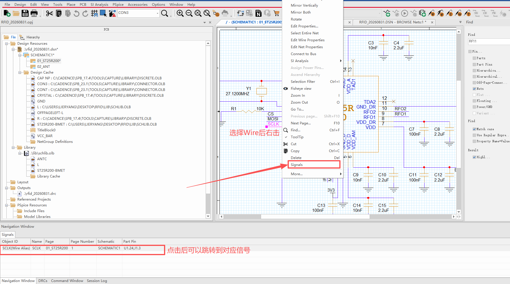
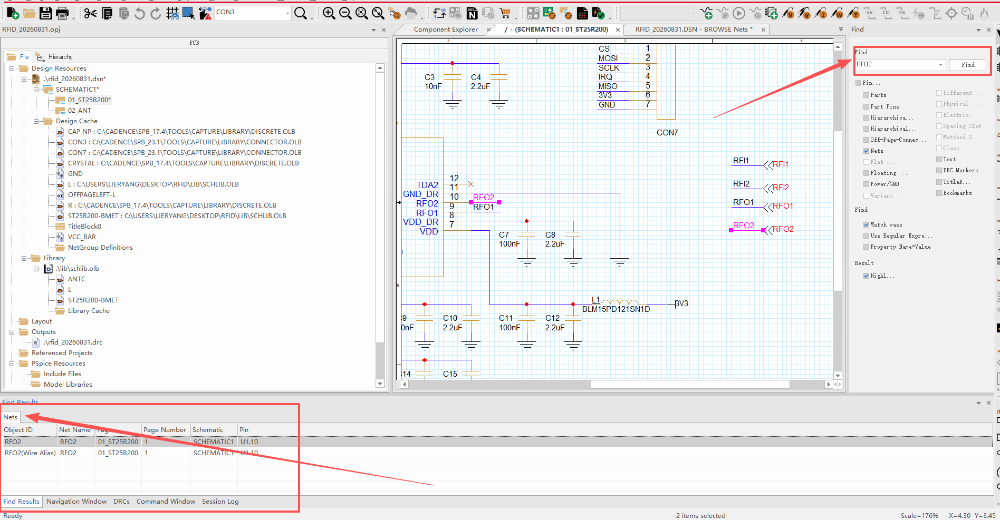

## 1 从导线上跳到整条网络

原理图里只看见一段线时，想知道这根网还连到哪些引脚，可以走 **右键 → Signals**。

操作步骤：

1. 在原理图上点选一段 **Wire**（上图点的是带 `SCLK` 别名的那根线）
2. 右击，在菜单里选 **Signals**
3. 底部 **Navigation Window** 会列出这条网络的全部连接

上图结果里，`SCLK` 出现在 `01_ST25R200` 第 1 页，对应器件引脚是 **U1.24 / J1.3**：ST25R200 的 24 脚和连接器 J1 的 3 脚都在这根 `SCLK` 上。

Navigation Window 各列含义：

| 列 | 图中取值 | 含义 |
|----|----------|------|
| Object ID | `SCLK(Wire Alias)` | 当前对象。带 `(Wire Alias)` 表示点中的是导线上的网络别名，不是器件引脚 |
| Net Name | `SCLK` | 网络名 |
| Page | `01_ST25R200` | 所在原理图页 |
| Page Number | `1` | 页码 |
| Schematic | `SCHEMATIC1` | 所属原理图 |
| Part Pin | `U1.24/J1.3` | 这条网连到的器件引脚，多个脚用 `/` 隔开 |

在 Navigation Window 里点某一行，视图会跳到对应位置，适合跨页、绕线很长时追信号。

同一右键菜单里容易一起用到的项：

| 菜单项 | 用途 |
|--------|------|
| **Signals** | 打开 Navigation Window，列出该网全部连接 |
| Select Entire Net | 选中整条网络（所有线段一起亮） |
| Edit Net Properties | 改网络属性 |
| Edit Wire Properties | 只改这一段线的属性 |
| Find...（Ctrl+F） | 打开查找，见下一节 |

## 2 用 Find 按网络名查找

已经知道网络名、但图上不好找时，用右侧 **Find** 面板（或 `Ctrl+F`）直接搜名字。

上图在 Find 输入框里填了 `RFO2`，点 **Find** 后：

- 原理图上这条网整段高亮（洋红），`RFO2` 的 Wire Alias 也会标出来
- 底部切到 **Find Results**，在左侧分类里选 **Nets**，只看网络命中

Find Results 里出现两行，都是同一根网，只是对象类型不同：

| Object ID | Net Name | Pin | 是什么 |
|-----------|----------|-----|--------|
| `RFO2` | `RFO2` | `U1.10` | 网络本身，连到 U1 的 10 脚 |
| `RFO2(Wire Alias)` | `RFO2` | （空） | 画在导线上的网络别名标签 |

点结果行同样会跳到图上对应位置。右侧 Find 面板还可以勾选搜索范围（Pins、Parts、Nets、Off-Page Connector 等）；只找网络时勾 **Nets** 即可，少很多无关结果。

和上一节的差别：

| | 右键 Signals | Find 搜网络名 |
|--|--------------|---------------|
| 起点 | 图上已经点中了一段线 | 只记得名字，图上还没找到 |
| 结果出现在 | Navigation Window | Find Results |
| 典型用途 | 从线段追到全部引脚 | 按名字定位、高亮整网 |

