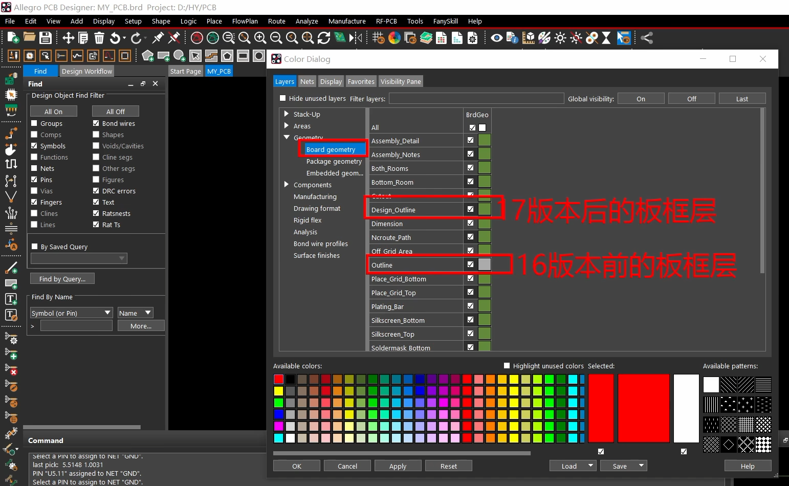
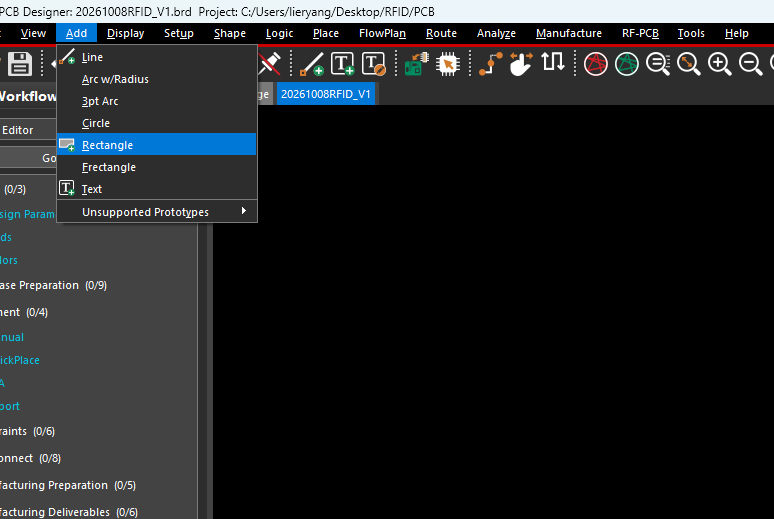
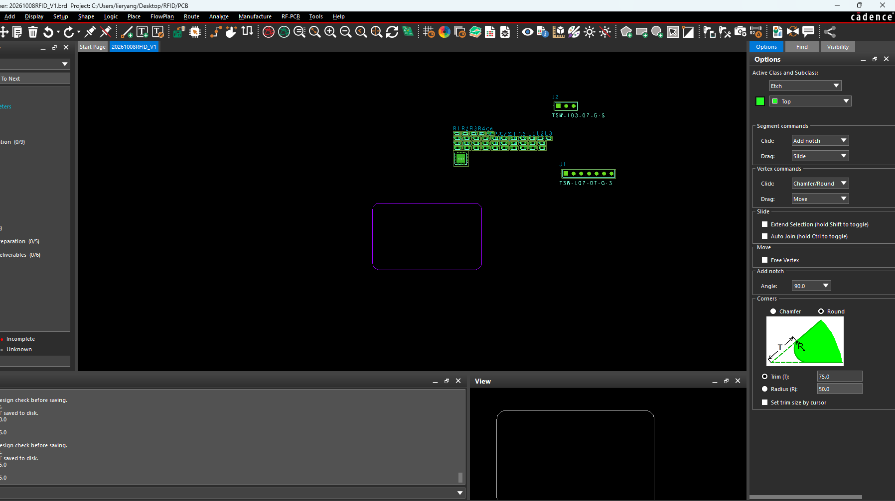

本文记录 Allegro PCB Editor 17.4 及后续版本的矩形板框绘制、尺寸调整、倒角、删除和退出编辑操作。不同菜单模式下，命令名称和位置可能略有不同。

## 一、板框所在的层

板框定义 PCB 的实际外形。在 17.4 及后续版本中，应使用以下 Class / Subclass：

| 项目 | 设置 | 用途 |
| --- | --- | --- |
| 外部板框 | `Board Geometry / Design_Outline` | 定义电路板外轮廓 |
| 板内挖空 | `Board Geometry / Cutout` | 定义板内开窗、挖空轮廓 |
| 布线允许区域 | `Route Keepin / All` | 定义布线允许区域 |
| 器件放置允许区域 | `Package Keepin / All` | 定义器件放置允许区域 |

`Design_Outline` 应当是一个完整、闭合的 Shape。旧版教程中的 `Board Geometry / Outline` 仍可能出现在图层列表里，但新设计应优先使用 `Design_Outline`。[Cadence 版本迁移说明](https://resources.pcb.cadence.com/i/1180190-migration-guide-for-allegro-platform-products/72)



上图展示了新旧板框层的位置。图片中的版本标注是简写；`Design_Outline` 在 17.2 中已经引入，本文按 17.4 及后续版本的方式操作。

## 二、放置矩形板框

### 1. 输入宽、高放置

需要精确尺寸时，使用 Design Outline 对话框比较方便：

1. 打开 `Setup → Outlines → Design Outline…`。部分菜单模式下为 `Outline → Design`。
2. 在 `Command Operations` 中选择 `Create`。
3. 在 `Create Options` 中选择 `Place rectangle`。
4. 输入 `Width`（宽度）和 `Height`（高度），注意当前设计单位。
5. 设置 `Design edge clearance`，即板边到 Route Keepin、Package Keepin 边界的内缩距离。
6. 将鼠标移到画布，单击放置矩形，再点击 `OK`。

例如，设计单位为 mm 时，设置宽度 `100`、高度 `50`，即可放置一个 **100 × 50 mm** 的矩形板框。这个入口会同时生成板框和对应的 Route Keepin、Package Keepin 区域。[Cadence 官方教程，第 62–63 页](https://www.cadence.com/content/dam/cadence-www/global/en_US/documents/solutions/cadence-cloud/oncloud/orcad-tutorial.pdf)

### 2. 用两个对角点绘制

也可以通过 `Shape → Rectangular` 创建板框：

1. 启动 `Shape → Rectangular`。
2. 在右侧 `Options` 中将 Class 设为 `Board Geometry`，Subclass 设为 `Design_Outline`。
3. 将 `Shape Fill Type` 设为 `Unfilled`。
4. 在画布上依次点击两个对角点。
5. 右键选择 `Done`，结束绘制。

需要精确坐标时，可以在命令窗口依次输入以下内容，每行输入后按 Enter：

```text
x 0 0
x 100 50
```

当设计单位为 mm 时，这两个点分别为 `(0, 0)` 和 `(100, 50)`，绘制结果为 **100 × 50 mm**。如果单位是 mils，同样的输入得到的是 **100 × 50 mil**；输入前先检查状态栏或 `Setup → Design Parameters → Design` 中的单位。



上图是 `Add → Rectangle` 的绘图入口。使用这个入口时，也要检查生成对象的层和类型：如果得到的是普通线段轮廓，需要通过 `Shape → Compose Shape` 转成闭合 Shape；新版菜单可能显示为 `Create Shape from Lines`，目标层选择 `Board Geometry / Design_Outline`。直接用 `Shape → Rectangular` 或 Design Outline 对话框创建板框更方便。[Cadence 关于闭合 Shape 板框的说明](https://community.cadence.com/cadence_technology_forums/pcb-design/f/pcb-design/48468/pcb-outline-error)

## 三、修改已放置板框的尺寸

矩形板框放置后仍然可以修改。常用方式是移动某条边，改变矩形的宽度或高度。

1. 先右键选择 `Done`，结束当前命令。
2. 打开 `Setup → Application Mode → Shape Edit`。
3. 在右侧 `Options → Segment commands` 中，设置 `Drag: Slide`。
4. 将鼠标放在板框某条直边上，确认该边高亮，再按住左键拖动。
5. 调整完成后，右键选择 `Done`。

| 操作 | 结果 |
| --- | --- |
| 移动左边或右边 | 修改板框宽度 |
| 移动上边或下边 | 修改板框高度 |
| 移动整个 Shape | 改变板框位置 |

如果习惯单击操作，可以将 `Segment commands → Click` 从 `Add notch` 改成 `Slide`。单击边线后移动鼠标，再单击确定位置；也可以在边线上右键选择 `Slide Segment`。

鼠标悬停时，如果高亮的是整个板框，可以按 `Tab` 在 Shape 和单条边之间切换，确认目标后再操作。已经倒角的板框需要连同相邻倒角一起调整时，可使用 `Slide → Extend Selection`。[Cadence Shape Edit 操作说明](https://community.cadence.com/cadence_blogs_8/b/pcb/posts/what-39-s-good-about-allegro-pcb-editor-shape-edit-application-mode-new-capabilities-in-16-6-2015)

例如，原板框为 **100 × 50 mm**，保持左边和下边不变，把右边向外移动 **20 mm**，板框就变为 **120 × 50 mm**。需要精确尺寸时，应通过坐标定位，并在修改后测量确认。

## 四、板框倒角与倒圆角

对闭合 Shape 板框，使用 Shape Edit 中的角点编辑功能。



### 1. 倒斜角：Chamfer

1. 进入 `Shape Edit` 模式。
2. 在右侧 `Options → Corners` 中选择 `Chamfer`。
3. 选择尺寸类型并输入数值。
4. 取消勾选 `Set trim size by cursor`，使用输入的固定尺寸。
5. 将鼠标放在板框的角点上，右键选择 `Trim Vertex`。
6. 依次处理其他角，完成后右键选择 `Done`。

`Trim (T)` 和 `Chamfer (C)` 的含义不同。对于矩形的 90° 角：

| 参数 | 含义 | 示例 |
| --- | --- | --- |
| `Trim (T)` | 原角点沿两条相邻边各退让的距离 | T = 2 mm，两边各退让 2 mm，斜边约为 2.828 mm |
| `Chamfer (C)` | 倒角后斜边的长度 | C = 2 mm，斜边为 2 mm，两边各退让约 1.414 mm |

因此，机械图要求的 **C2（45°）** 若表示两条直边各退让 2 mm，应在这里选择 **`Trim (T) = 2 mm`**。

### 2. 倒圆角：Round

1. 在 `Options → Corners` 中选择 `Round`。
2. 选择 **`Radius (R)`**，输入所需半径，例如设计单位为 mm 时输入 `2`，表示 **R2**。
3. 取消勾选 `Set trim size by cursor`。
4. 在需要处理的角点上右键选择 `Trim Vertex`。
5. 完成后右键选择 `Done`。

如果将 `Vertex commands → Click` 设为 `Chamfer/Round`，也可以直接单击角点应用当前倒角设置。

注意上图中选中的是 **`Round` 和 `Trim (T)`**，虽然下面显示 `Radius (R): 50.0`，但不能据此认定当前按 R50 操作。要按半径倒圆角，必须选中 `Radius (R)` 前面的单选按钮。参数数值使用当前设计单位；例如 **50 mil = 1.27 mm**。

### 3. 一次处理所有角

设置好 Chamfer 或 Round 参数后，将鼠标放在板框边界上，右键选择 `Shape → Trim vertices`。如果已经通过 `Tab` 切换到整个 Shape，右键菜单也可能直接显示 `Trim vertices`。

`Trim Vertex` 处理一个角点，`Trim vertices` 处理整个 Shape 的角点。上述参数和操作可参考 [Cadence 官方图文教程](https://community.cadence.com/cadence_blogs_8/b/pcb/posts/what-39-s-good-about-allegro-pcb-editor-shape-edit-application-mode-new-capabilities-in-16-6-2015)。

## 五、删除板框

右键菜单没有 `Delete` 时，可以先启动删除命令，再选择板框：

1. 右键选择 `Done`，结束当前绘制、Slide 或倒角命令。
2. 切换到 `General Edit` 模式。
3. 打开 `Edit → Delete`。
4. 在右侧 `Find` 面板中点击 `All Off`，然后只勾选 `Shapes`。
5. 左键点击 `Board Geometry / Design_Outline` 板框边缘。
6. 删除完成后，右键选择 `Done`。

也可以打开 `Setup → Outlines → Design Outline…`，在 `Command Operations` 中选择 `Delete`，按命令栏提示完成删除。这个对话框的 Create、Edit、Move、Delete 入口见 [官方教程，第 63 页](https://www.cadence.com/content/dam/cadence-www/global/en_US/documents/solutions/cadence-cloud/oncloud/orcad-tutorial.pdf)。

如果提示 `FIXED` 或 `Cannot modify element`，需要先解除目标板框的固定属性，再执行删除。如果提示找不到对象，检查板框是否可见、Find 是否勾选了 Shapes，以及实际对象是否属于 Design_Outline。

## 六、退出编辑并保存

结束当前命令和切换编辑模式是两个操作：

| 目的 | 操作 |
| --- | --- |
| 完成当前绘制、移动或倒角操作 | 在画布中右键选择 `Done`；默认快捷键为 `F6` |
| 退出 Shape Edit 模式 | `Setup → Application Mode → General Edit` |
| 保存 PCB 文件 | `Ctrl + S` |

快捷键可以自定义；如果 F6 不起作用，以右键菜单中的 `Done` 为准。

## 七、操作时容易混淆的地方

- **Slide 与倒角尺寸不同。** `Segment commands → Slide` 用于移动边线；`Corners → Trim / Radius` 控制倒角，不是矩形的宽、高输入框。
- **当前活动层与所选对象要分别确认。** 截图顶部显示 `Etch / Top`，进行板框操作前，应确认目标对象实际属于 `Board Geometry / Design_Outline`；新建板框时必须设置正确的层。
- **Shape 与线段的选择过滤器不同。** 完整板框按 Shapes 选择；若只按 Lines 或 Other segs 查找，可能选不到闭合板框。
- **板框修改后检查 Keepin。** 调整尺寸、倒角或删除后，检查 Route Keepin、Package Keepin 是否仍符合新的外形和内缩距离，需要时重新调整或生成。
