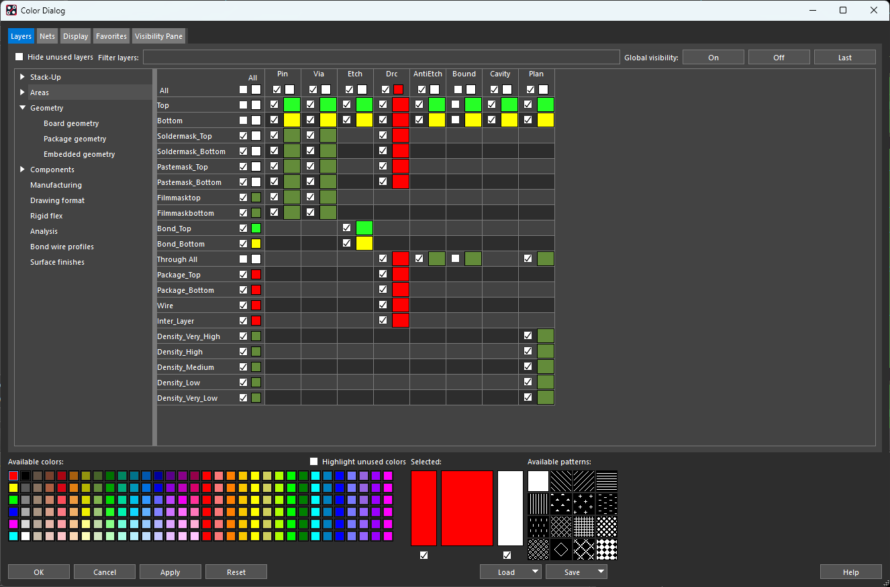
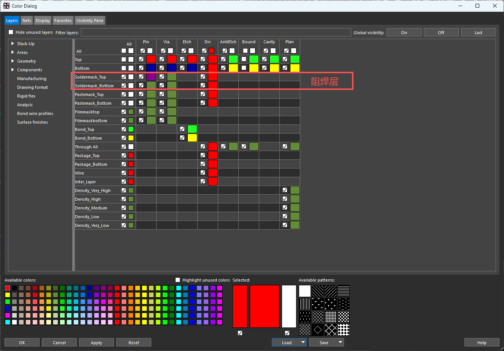
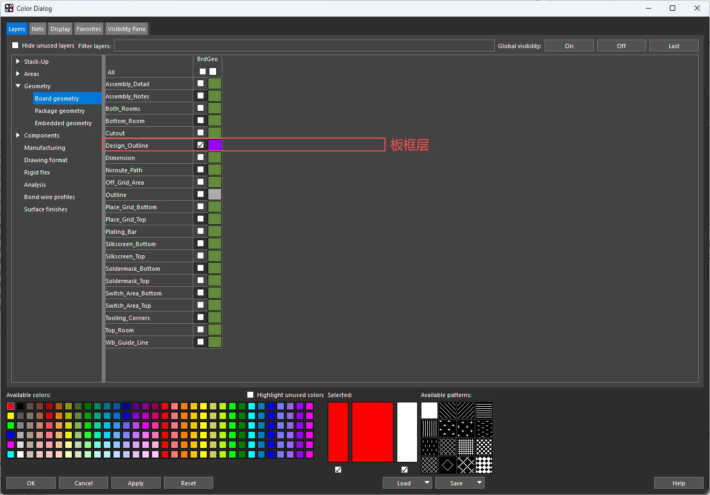
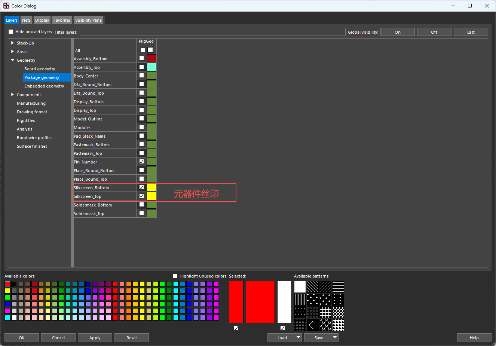
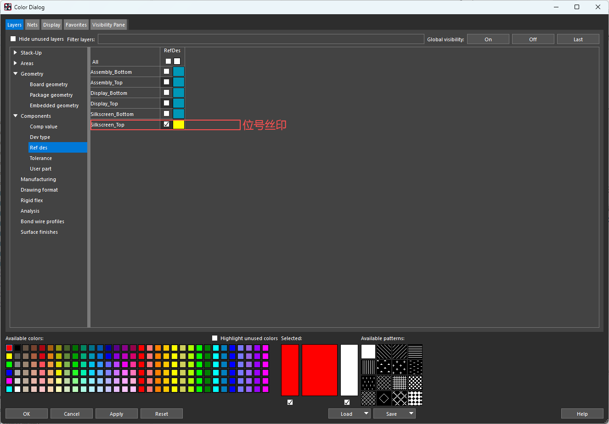

## Geometry 的含义与分类

在 Color Dialog 的 `Geometry` 分类下，可以看到 `Board geometry`、`Package geometry` 和 `Embedded geometry`。Geometry 表示几何图形；这三个项目是图形对象的类别（Class），区别主要在于图形属于整块电路板、某个器件封装，还是板内嵌入式器件。

| 类别 | 中文含义 | 常见用途 |
| --- | --- | --- |
| `Board Geometry` | 板级几何图形 | 整块 PCB 的板框、板内挖空、板级丝印、尺寸标注等 |
| `Package Geometry` | 器件封装几何图形 | 封装丝印、装配外形、器件占用边界等；封装内的这些图形通常随器件一起移动、旋转 |
| `Embedded Geometry` | 嵌入式器件几何图形 | 放置在 PCB 内部的器件所使用的几何信息，例如嵌入介质层中的电容等特殊设计 |

制作封装时，封装自身的图形通常使用 Package Geometry；在整块板上增加图形时，通常使用 Board Geometry。可参考 [Cadence 关于 Package Geometry 与 Board Geometry 的说明](https://community.cadence.com/cadence_technology_forums/pcb-design/f/pcb-design/37648/package-geometry-vs-board-geometry/1351970)。Embedded Geometry 用于板内嵌入式器件，见 [Cadence 嵌入式器件示例](https://community.cadence.com/cadence_blogs_8/b/pcb/posts/what-39-s-good-about-allegro-pcb-editor-two-layer-pcb-support-check-out-16-6)。普通表面贴装、通孔器件的 PCB 设计一般不需要使用 Embedded Geometry。

这些类别下面还有子类（Subclass），用来区分具体用途。例如 `Board Geometry / Design_Outline` 中，`Board Geometry` 是 Class，`Design_Outline` 是 Subclass。它们并不代表三层铜层；铜层上的走线和铜皮通常属于 `Etch / Top`、`Etch / Bottom` 等类别和子类。

同样叫 `Silkscreen_Top`，放在不同 Geometry 中，表示的内容也不同：

| Class / Subclass | 内容示例 |
| --- | --- |
| `Board Geometry / Silkscreen_Top` | 板名、版本号、Logo、接口说明等板级丝印 |
| `Package Geometry / Silkscreen_Top` | 电阻、芯片、连接器等封装自身的丝印外形线 |
| `Ref Des / Silkscreen_Top` | R1、C1、U1 等器件位号；属于 Ref Des 类 |

输出顶层丝印时，通常需要同时包含上面三项。[Cadence 丝印输出说明](https://resources.academic.cadence.com/pcb-design-and-analysis-resources/2024-how-to-generate-gerber-files-in-orcad-x-cadence)

Geometry 与 Shape 也是两个不同概念：**Geometry 类别说明对象的用途，Shape 说明对象的类型**。例如，板框是放在 `Board Geometry / Design_Outline` 上的闭合 Shape。绘制板框时，选择 Board Geometry；制作封装外形时，主要使用 Package Geometry。

