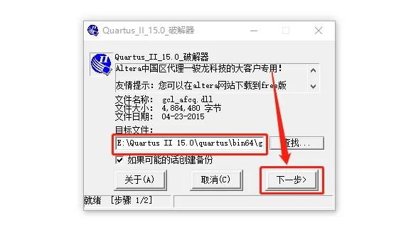
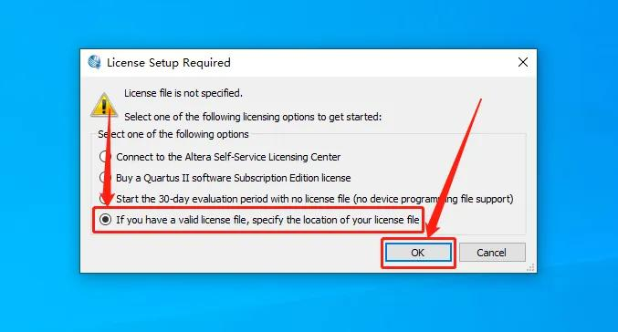
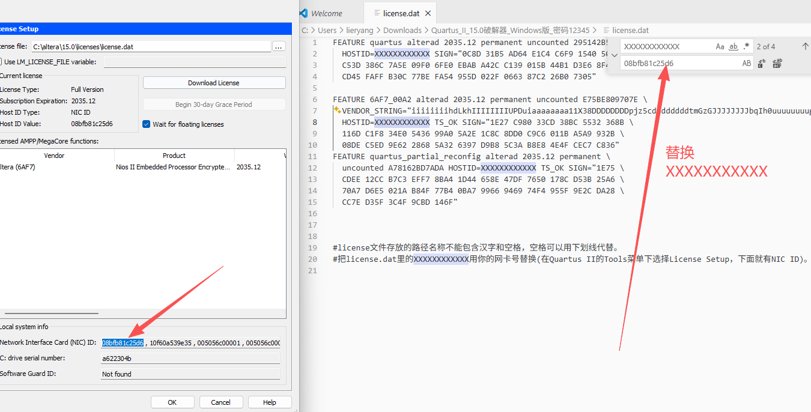
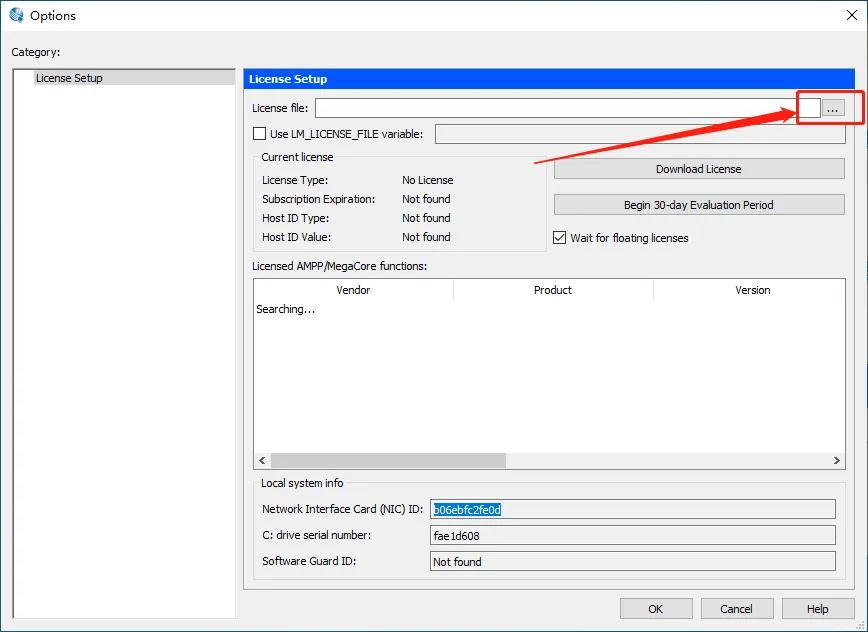

## 1 Quartus II

Quartus II下载链接：[http://download.altera.com/akdlm/software/acdsinst/15.0/145/ib_installers/QuartusSetup-15.0.0.145-windows.exe ](http://download.altera.com/akdlm/software/acdsinst/15.0/145/ib_installers/QuartusSetup-15.0.0.145-windows.exe )

## 2 破解过程

1. 打开 `Quartus_II_15.0` 注册机，给 `C:\altera\15.0\quartus\bin64\gcl_afcq.dll`

    

2. 打开 `QuartusII 15.0`，选择 `If you have a valid license···`

    

3. 复制软件的ID号，到 `license.dat`，然后进行替换

    

4. 许可文件载入

    

## 参考

[参考1： Quartus II 15.0破解版下载安装教程](https://www.fujieace.com/software/quartus-ii-15-0.html)

[参考2： Quartus II 15软件安装](https://blog.csdn.net/yxswhy/article/details/79610908)

[参考3： Quartus II 15.0 Windows64&Linux版本下载链接，以及Crack共享](https://bbs.eeworld.com.cn/thread-461297-1-1.html)

https://www.bilibili.com/video/BV1Ga4y1f7hy?spm_id_from=333.788.videopod.episodes&vd_source=e6b01e2e688ed9241677df121e4b897a&p=5
