## 1 FPGA下载方式

FPGA的配置方式主要包括主动配置（AS）、被动配置（PS）、JTAG配置等多种方式。不同的配置方式适用于不同的应用场景。

### 1.1 主动配置（AS - Active Serial）

**工作原理：**
- FPGA作为主设备，主动从外部配置芯片（如EPCS、EPCQ系列）读取配置数据
- FPGA提供时钟信号，控制整个配置过程
- 配置数据存储在专用的串行配置芯片中

**特点：**
- 上电后自动加载配置数据，无需外部控制
- 配置速度较慢（串行传输）
- 适合独立工作的FPGA系统
- 配置芯片专用，成本相对较高

**文件后缀：**

- `.jic` (JTAG Indirect Configuration) - 通过JTAG接口间接配置Flash（需要FPGA作为桥梁，间接烧写到Flash，使用USB-Blaster等JTAG下载器）

- `.pof` (Programmer Object File) - 需要使用专用的编程器（如独立的Flash编程器）直接对Flash进行烧写，不需要FPGA参与烧写过程。

### 1.2 被动配置（PS - Passive Serial）

**工作原理：**
- FPGA作为从设备，被动接收外部主控器发送的配置数据
- 外部主控器（如MCU、CPU）提供时钟和数据
- 配置数据通常存储在外部Flash中

**特点：**
- 需要外部处理器控制配置过程
- 可以使用通用Flash存储器，成本较低
- 灵活性高，可实现远程更新、多配置切换
- 配置速度取决于主控器性能

**文件后缀：**
- `.rbf` (Raw Binary File) - 原始二进制配置文件
- `.hex` - Intel HEX格式配置文件

### 1.3 JTAG配置

**工作原理：**
- 通过JTAG接口直接将配置数据下载到FPGA
- 使用下载器（如USB-Blaster）连接PC和FPGA
- 配置数据直接写入FPGA的SRAM

**特点：**
- 主要用于开发调试阶段
- 下载速度快，操作简单
- 掉电后配置丢失（易失性）
- 不适合产品化应用

**文件后缀：**
- `.sof` (SRAM Object File) - 用于直接配置FPGA SRAM

## 2 配置方式对比

| 配置方式 | 主/从模式 | 配置速度 | 掉电保持 | 应用场景 | 主要文件格式 |
|---------|----------|---------|---------|---------|-------------|
| AS主动配置 | FPGA为主 | 慢（串行） | 是 | 独立系统 | .pof, .jic |
| PS被动配置 | FPGA为从 | 中等 | 是 | 有MCU系统 | .rbf, .hex |
| JTAG直接 | PC为主 | 快 | 否 | 开发调试 | .sof |

## 3 常见文件格式详解

### 3.1 .sof (SRAM Object File)
- **用途：** JTAG直接下载到FPGA SRAM
- **特性：** 掉电丢失，主要用于开发调试
- **大小：** 通常几百KB到几十MB
- **生成：** Quartus编译后自动生成

### 3.2 .pof (Programmer Object File)
- **用途：** 烧写到专用配置芯片（EPCS/EPCQ）
- **特性：** 掉电保持，适合产品化
- **大小：** 包含完整配置数据
- **生成：** 需要通过Convert Programming File工具转换

### 3.3 .jic (JTAG Indirect Configuration)
- **用途：** 通过JTAG烧写到Flash
- **特性：** 掉电保持，开发和产品都适用
- **大小：** 包含Flash和FPGA的配置信息
- **生成：** 通过Convert Programming File工具转换

### 3.4 .rbf (Raw Binary File)
- **用途：** 被动配置，由外部处理器加载
- **特性：** 纯二进制格式，无文件头
- **大小：** 配置数据的原始大小
- **生成：** Quartus编译时可选生成

### 3.5 .hex (Intel HEX File)
- **用途：** 文本格式的配置文件
- **特性：** 可读性好，便于处理
- **大小：** 比.rbf大（文本格式）
- **生成：** 可由.sof或.rbf转换得到

## 4 使用JTAG烧写SOF程序

1. 编写代码

    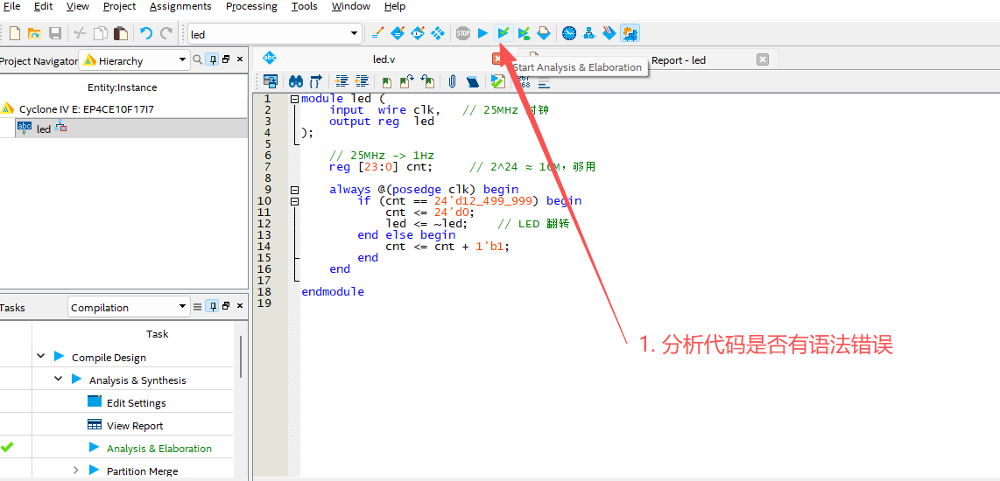

2. 选择相应的IO管脚

    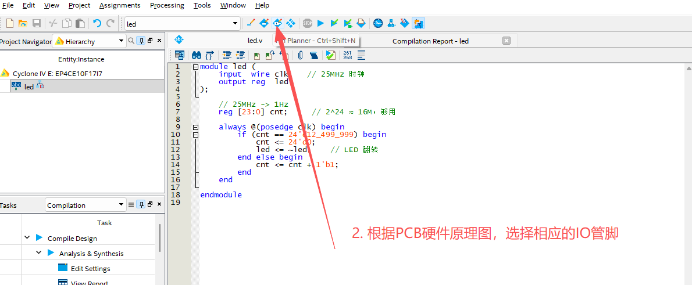

    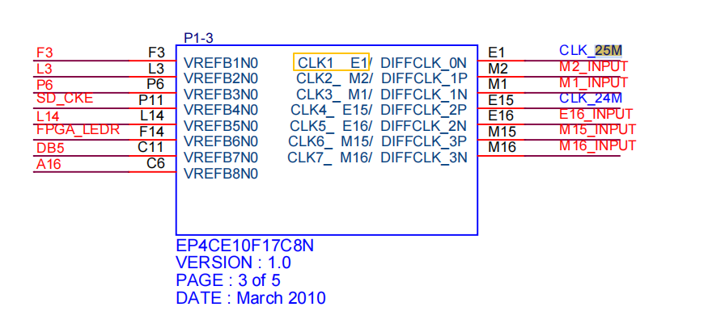

    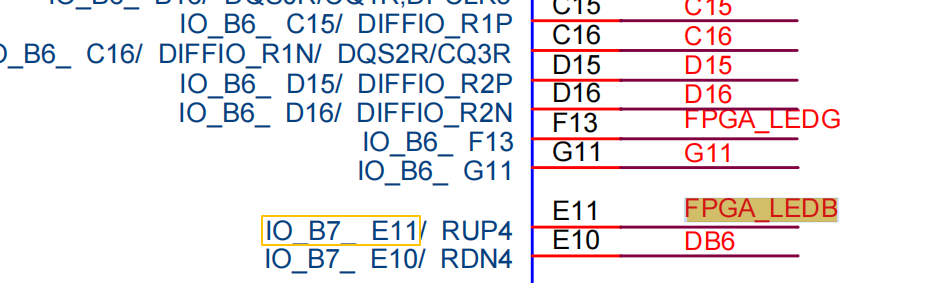

    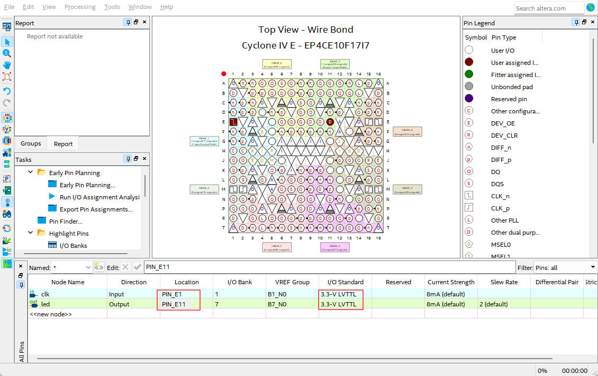

3. 编译

    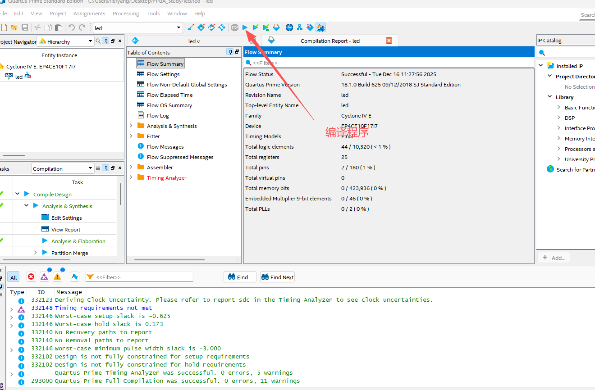

4. 使用JTAG下载 `***.sof`
   
    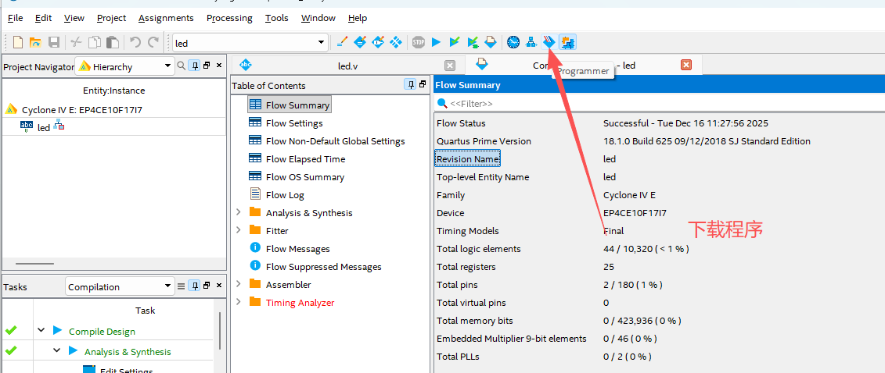

    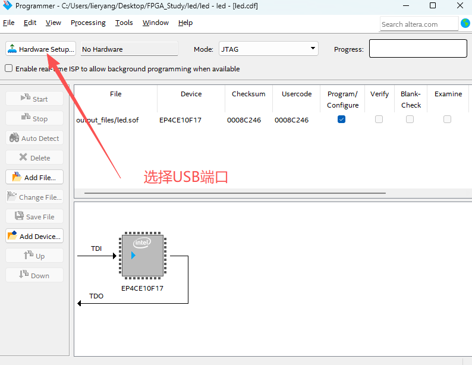

    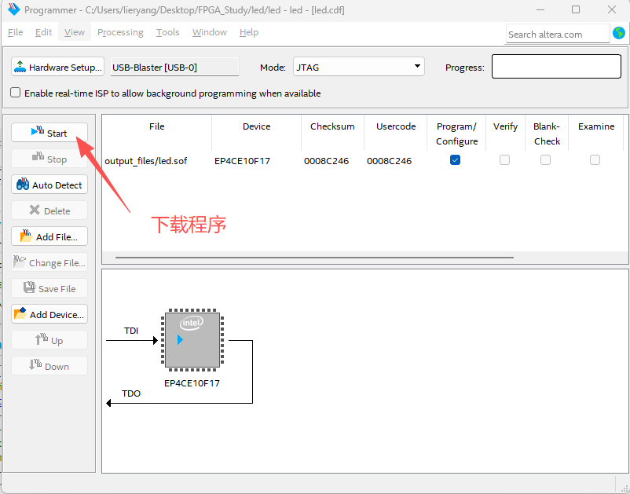

## 5 使用JTAG烧写JIC程序

1. FPGA配置成AS下载模式

    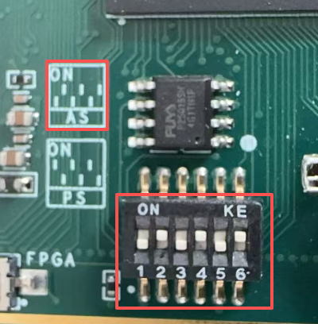

2. 将 `***.sof` 转换成 `***.jic` 程序。
   
    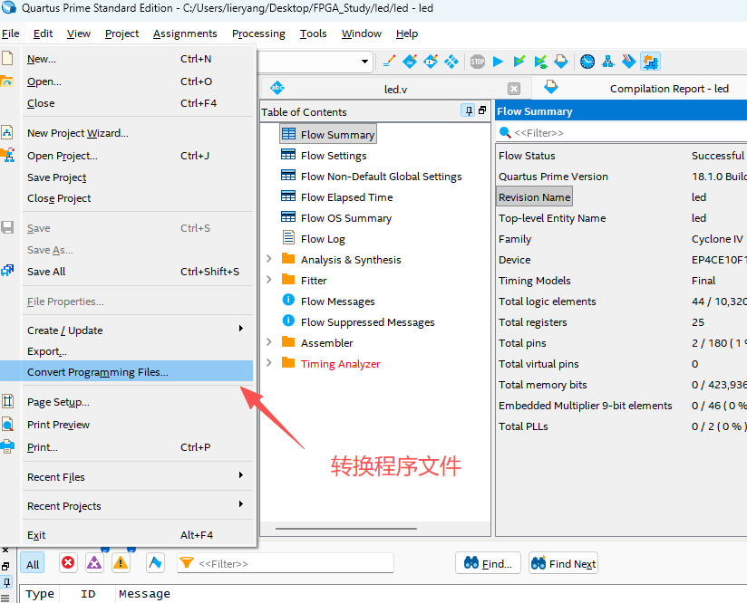

    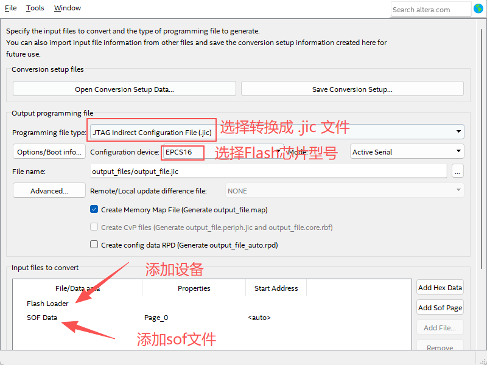

    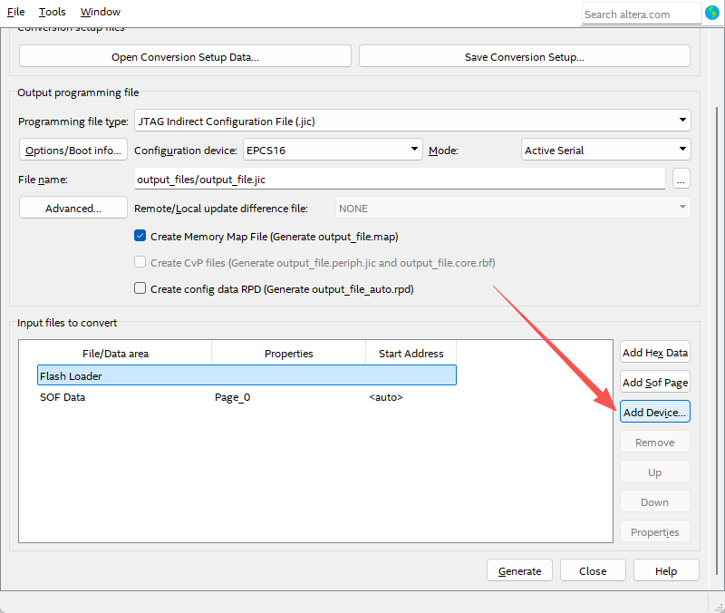

3. 使用JTAG烧写 `***.jic` 程序。
   
    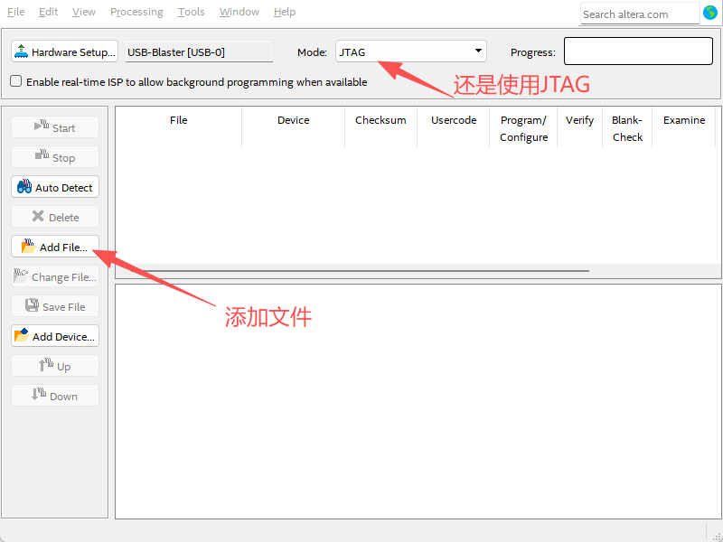

    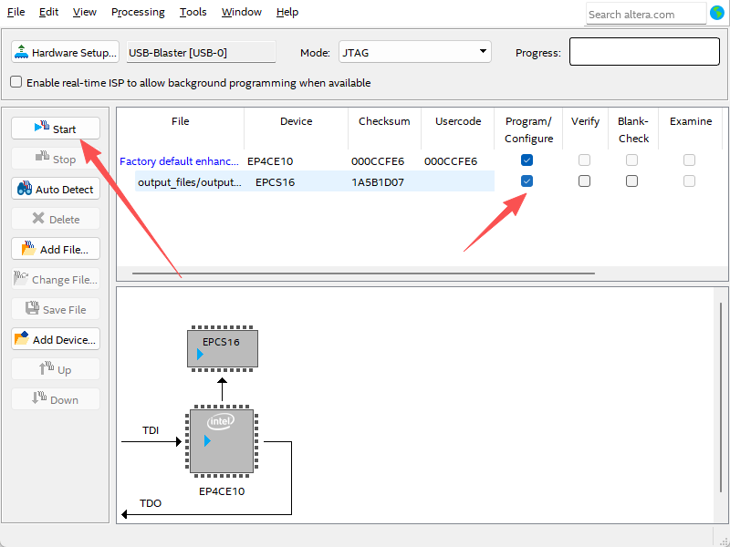