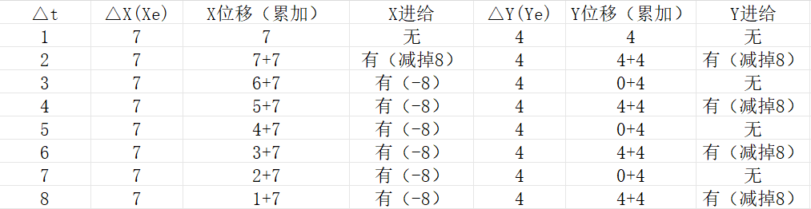

## 1 直线插补

直线的插补算法大概有以下类型：

- **逐点比较法**: 用整数累积误差 e，判断什么时候增加次要轴的步。每次只走一个轴。
  
  

- **数字积分法**：积分δX和δY进行判断是否要走，多个轴可以同步走。δt的次数等于max(x, y)的2的最小二次方值。
  
  

- **浮点DDA**: 浮点DDA可以使用更少的δt次数 = max(x,y)。

### 1.1 数字积分法


曲线的速度等于V(x)和v(y)的合成速度，实际编写程序中，需要把V分解到各个轴。


这里的比例K，其实可以看成就是时间t，只不过接下来t不是连续的。所以m个δt才等于整个时间t。


<font color="red">

1. δX要小于1，才会保证每次积分都是一个脉冲内，不会产生误差。如果δx = 1.6，积分一次就等于3.2，就不是发一个脉冲了。

2. m就是δt的次数（进行积分的次数）。

3. 为什么会选 1/(2^n) 作为K，因为只有选择一个(2^n) 才能使得 max(X,Y)，从而 δX < 1，保证每次积分都能在1个脉冲内。为什么选择2^n作为最大值，整形为了寄存器运算方便。

</font>


这里的Xe(Ye)代替KXe（KYe），请看下面例题分析。

#### 1.1.1 数字积分法例题：使用δX


选取2的n次，这里选择n = 3，也就是8。

所以： k = 1/8，δX = 7/8，δY = 4/8

#### 1.1.2 数字积分法例题：使用Xe

因为选择小数，浮点运算慢，所以：全部乘以 2^n = 8

此时的 δX = Xe = 7， δY = Ye = 4，当积分值大于8的时候发出一个脉冲。




### 1.2 GRBL中的数字积分法

示例如上，从(0, 0) 到 (7, 4)

初值等于 max(x, y) / 2 = 3， δX = X， δY = Y

判断是否大于 max(x,y) ，如果大于 max(x, y)，就进给，减去max(x, y)


```c
int32_t dx = abs(target_x - current_x);
int32_t dy = abs(target_y - current_y);

int32_t max_step = (dx > dy) ? dx : dy;
int32_t err_x = max_step / 2;
int32_t err_y = max_step / 2;

for (int32_t i = 0; i < max_step; i++)
{
    // X轴
    err_x += dx;
    if (err_x > max_step)
    {
        step_x();
        err_x -= max_step;
    }

    // Y轴
    err_y += dy;
    if (err_y > max_step)
    {
        step_y();
        err_y -= max_step;
    }
}
```

## 2 圆弧插补


[参考1： 数字积分法直线DDA视频1](https://www.bilibili.com/video/BV1TC4y1h7EA/?spm_id_from=333.337.search-card.all.click&vd_source=e6b01e2e688ed9241677df121e4b897a)

[参考2： 数字积分法直线DDA视频2](https://www.bilibili.com/video/BV1zC4y1874C/?spm_id_from=333.788.comment.all.click&vd_source=e6b01e2e688ed9241677df121e4b897a)

