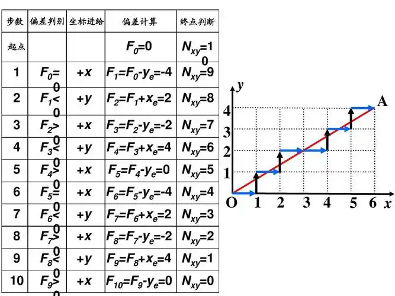
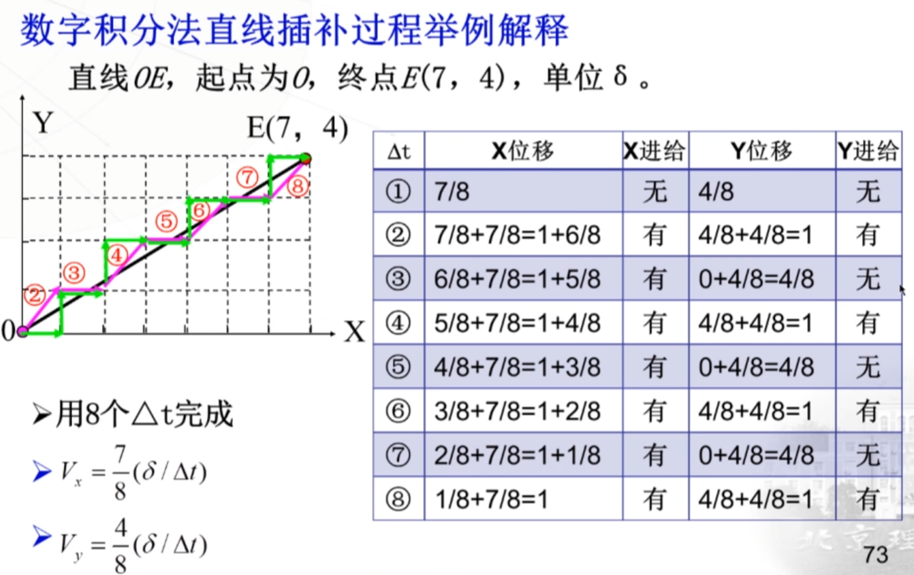
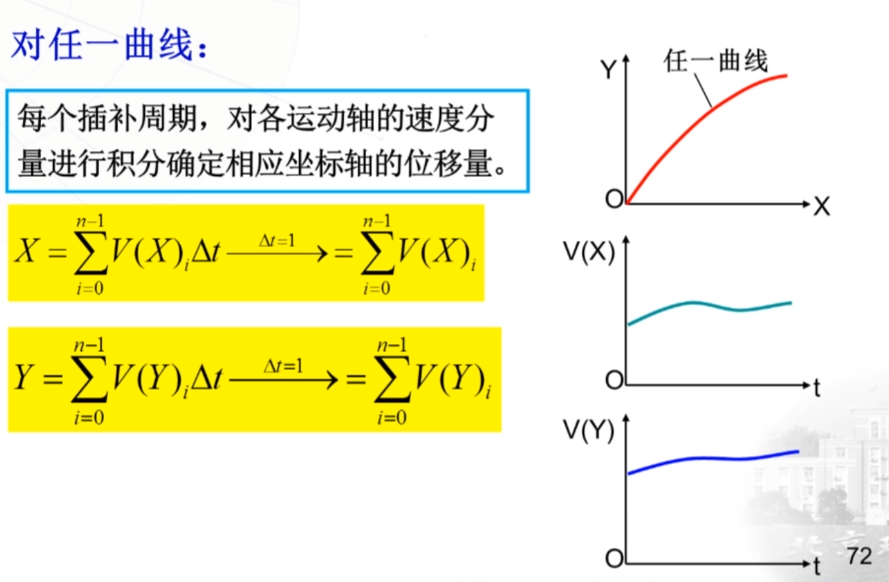
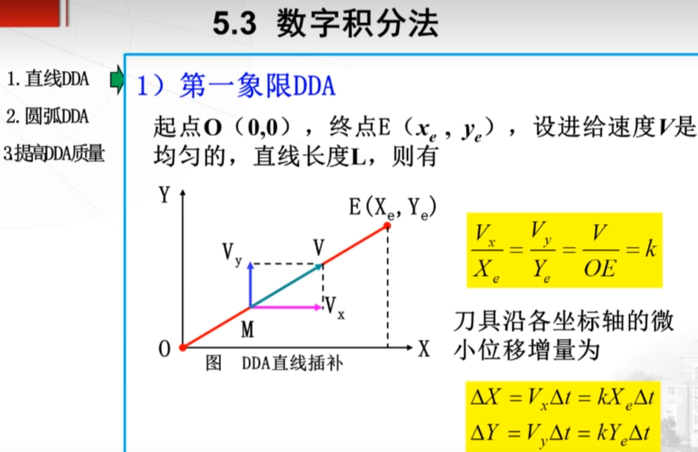
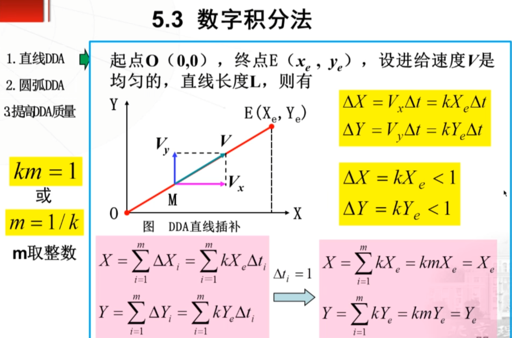
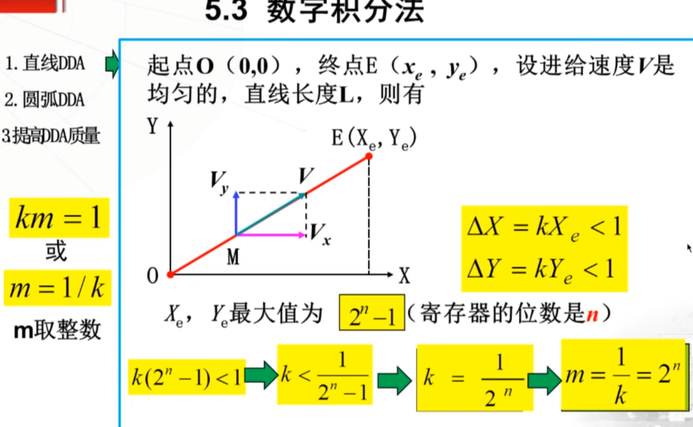
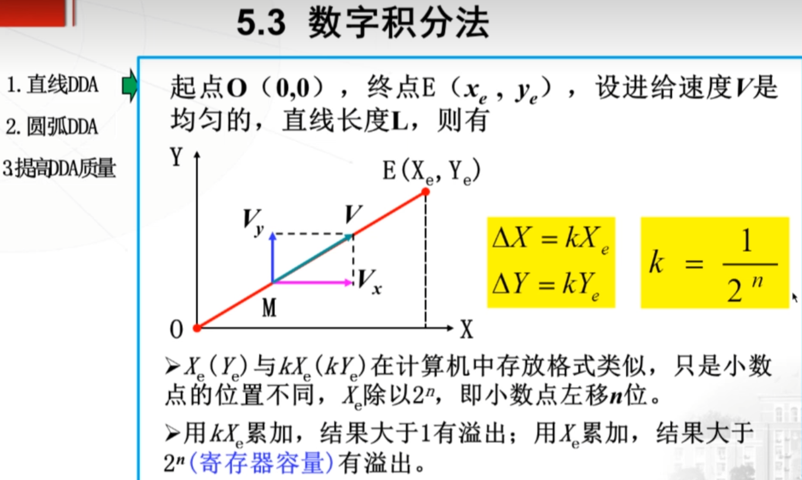
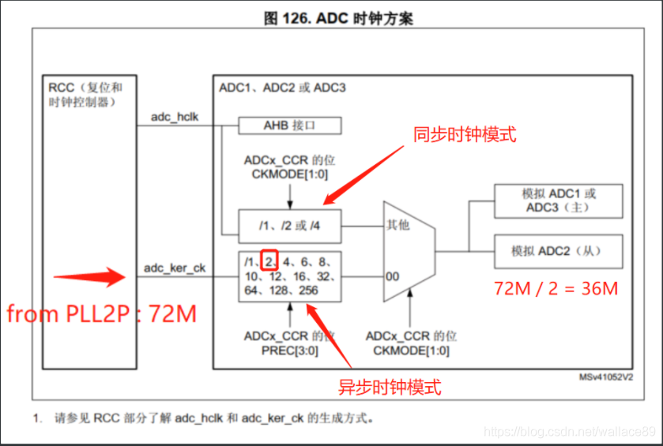
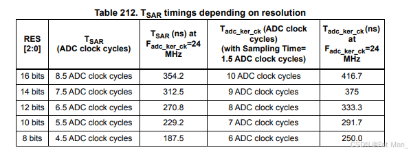
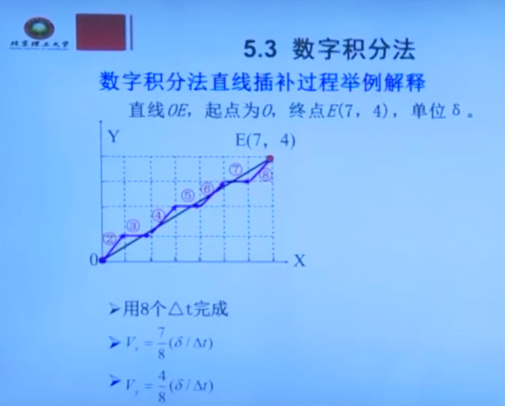

## 1 直线插补

直线的插补算法大概有以下类型：

- **逐点比较法**: 用整数累积误差 e，判断什么时候增加次要轴的步。每次只走一个轴。
  
  

- **数字积分法**：积分δX和δY进行判断是否要走，多个轴可以同步走。δt的次数等于max(x, y)的2的最小二次方值。
  
  

- **浮点DDA**: 浮点DDA可以使用更少的δt次数 = max(x,y)。

### 1.1 数字积分法

曲线的速度等于V(x)和v(y)的合成速度，实际编写程序中，需要把V分解到各个轴。

这里的比例K，其实可以看成就是时间t，只不过接下来t不是连续的。所以m个δt才等于整个时间t。

1. δX要小于1，才会保证每次积分都是一个脉冲内，不会产生误差。如果δx = 1.6，积分一次就等于3.2，就不是发一个脉冲了。

2. m就是δt的次数。

3. 为什么会选 1/2^n 作为K，因为只有大于max(X,Y)，δX < 1，保证每次积分都能在1个脉冲内。

### 数字积分法例题

 1. 为什么要用8个δt？

[参考1： 数字积分法直线DDA视频1](https://www.bilibili.com/video/BV1TC4y1h7EA/?spm_id_from=333.337.search-card.all.click&vd_source=e6b01e2e688ed9241677df121e4b897a)