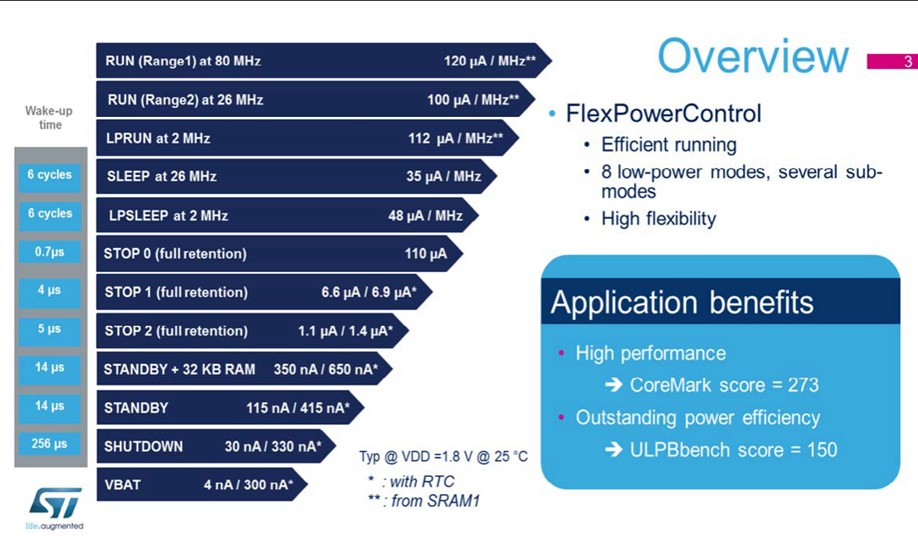
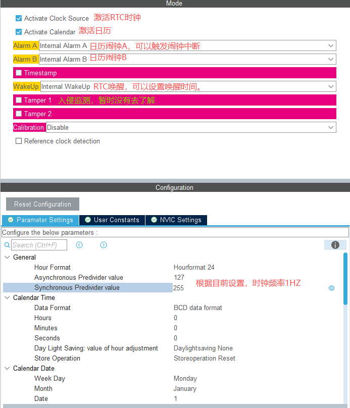

## 1 ADC工作原理

ADC芯片即模数转换器，是将模拟量转化为数字量的芯片，在如今的这个时代，这是很重要的芯片。在许多高精度测量领域，都在大规模的使用ADC芯片，我们在做项目的时候也会大量使用，熟悉它的参数才能更好的使用它。

模拟信号转化为数字信号，一般分为4个步骤进行，即采样、保持、量化、编码。前两个步骤在采样-保持电路中完成，后两个步骤则在ADC中完成。ADC是把经过与标准量比较处理后的模拟量转化为二进制数值表示的离散信号的转化器。所以任何一个模数转化器都需要一个参考模拟量作为转换的标准，比较常见的参考标准为ADC芯片最大的可转换信号大小。

- **采样**：ADC打开采样开关，电容对输入电压充电并保持。采样时间（Sampling Time），由软件设置（ADC_SMPRx寄存器），一般可以设置1.5Cycles，2.5Cycles，8.5Cycles，16.5Cycles等。

- **保持**：断开模拟开关，把输入的模拟电压“抓住并暂存”，为了整个转换过程中保持不变。因为接下来的量化（数字转换）需要一定时间（比如逐次逼近12位大约要12个比较步骤）。

- **量化**：量化是保持之后进行的动作，是 ADC 将“保持的模拟电压”变成数字值的过程。在STM32的ADC中，量化通常由SAR（逐次逼近寄存器）实现，通过与DAC输出的参考电压比较。

- **编码**：把量化后的二进制数据，转换成电压。


## 2 时钟

根据下面STM32H7的ADC表，<font color="red">ADC频率最大36Mhz，需要开启BOOST = 1 </font>


可以将PLL2设置为72Mhz，ADC预分频设置为2（异步时钟模式），就是36Mhz。（ADC工作频率超过36M会不稳定）。

<font color= "green">上面使用的是异步时钟模式，暂时还没研究异步和同步的区别</font>


## 3 






- **Scan Conversion Mode（扫描模式）**：由于现在只使用一个ADC通道，如果使用扫描多个ADC通道，我们就需要设置扫描顺序，让哪个通道先转换，谁后转换。

- **Continuous Conversion Mode（连续转换模式）**：如果不使能连续采样的话，ADC采集完一次数据后将数据保存到数据存储寄存器中之后，ADC就暂停工作了，之后想要再使用需要代码重新开启。如果设置为使能，ADC数据就会不断地进行更新采样通道引脚上的电平，等我们需要用的时候，我们只需要访问寄存器里面的数据即可。

- **Discontinuous Conversion Mode（不连续序列转换模式）**：配置ADC规则组转换序列的不连续方式。这里的不连续含义是指每次触发进行一个子组的转换，跟Continuous Conversion Mode的连续含义不一样。例如使能了该配置，该参数的下方就立马出现Number Of Discontinuous Conversions，如果它设为2，且ADC1使能了通道1，2，5，7，10，11的话，那么第一次触发ADC1采样时，就会采样通道1与通道2的值，再一次触发ADC1采样的话，就会采样通道5与通道7值，如此类推。值得注意的是，Continuous Conversion Mode与Discontinuous Conversion Mode不能同时使能，两者不能共存。

- **External Trigger Conversion Source（外部触发转换源）**：可以选择软件开始，也可以选择定时器触发（定时器可以精准周期测量）。

- **End of Conversion Selection（结束转换的选择）**：选择结束转换的事件。有End of single conversion（EOC） 与 End of sequence of conversion（EOS）两种选择。这两个事件会触发中断与DMA。一般选择EOS，等所有通道转换完毕后，产生中断后将全部数据取出来，或者使用DMA将全部数据取出来。

- **Overrun behaviour（溢出处理行为）**：选择Overrun data overwritten。ADC+DMA是很好的组合，根据安富莱的解释，有了DMA的话，不管怎样都会溢出错误。

- **Conversion Data Management（ADC转换结果如何输出）**：
    
    -  ADC_CONVERSIONDATA_DR： 结果只存进 ADC_DR 寄存器
    
    -  ADC_CONVERSIONDATA_DFSDM： 通过 DFSDM（数字滤波模块） 读取
    
    -  ADC_CONVERSIONDATA_DMA_ONESHOT： 数据通过DMA搬运一次到RAM
    
    -  ADC_CONVERSIONDATA_DMA_CIRCULAR： 数据通过DMA循环搬运


<font color="red">注意：</font>

1. 连续转换使能，ADC转换只要启动一次，就会不停运行。如果使用定时器更新事件控制，需要关闭连续转换。因为定时器每更新中断一次，都会开启一次ADC转换。

2. 


### 1 DMA实验

1 软件触发

- 如果只转换一次，连续转换不使能。

- 如果 `HAL_ADC_Start_DMA(ADC_HandleTypeDef *hadc, uint32_t *pData, uint32_t Length)` 要求的Length转换完就停止，就需要设置 `ConversionDataManagement` 为 `ADC_CONVERSIONDATA_DMA_ONESHOT`。

- 如果一直转换，就需要使能连续转换，同时设置  `ConversionDataManagement` 为 `ADC_CONVERSIONDATA_DMA_CIRCULAR`。

2 定时器中断触发

- 连续转换不使能。

- 设置  `ConversionDataManagement` 为 `ADC_CONVERSIONDATA_DMA_CIRCULAR`。


```c

status = HAL_ADCEx_Calibration_Start(&hadc1, ADC_CALIB_OFFSET_LINEARITY, ADC_SINGLE_ENDED);

status = HAL_ADC_Start_DMA(&hadc1, (uint32_t*)adc_buffer, 10);


/**
 * @brief ADC DMA转换完成回调函数
 */
void HAL_ADC_ConvCpltCallback(ADC_HandleTypeDef* hadc)
{
    if (hadc->Instance == ADC1)
    {
        adc_dma_complete_flag = 1;
        // printf("软件触发ADC DMA传输完成中断触发!\r\n");
    }
}

/**
 * @brief ADC DMA转换半完成回调函�??
 */
void HAL_ADC_ConvHalfCpltCallback(ADC_HandleTypeDef* hadc)
{
    if (hadc->Instance == ADC1)
    {
        // printf("ADC DMA传输半完成!\r\n");
    }
}


```


## 双重ADC同步规则模式采集试验

对于双重 ADC模式，转换的启动只能是 ADC1主和ADC2从的交替触发或同步触发。


