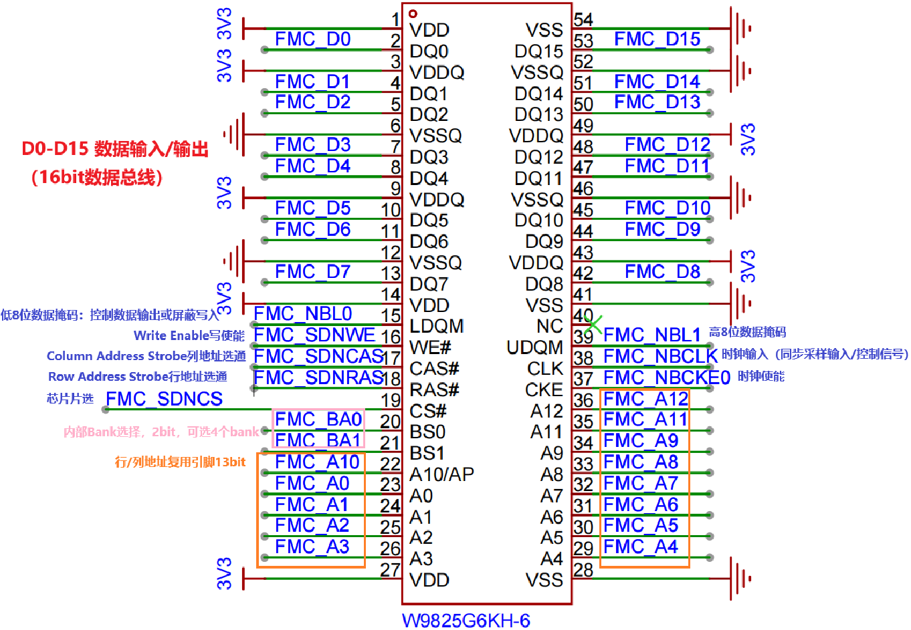

## 1 SDRAM芯片简介

SDRAM (Synchronous Dynamic RandomAccess Memory),同步动态随机存储器。同步是指其时钟频率与CPU的前端总线的系统时间频率相同，并且他的内部命令的发送与数据的传输都是以这个时钟为基准的，动态是指存储阵列需要不断的刷新才能保证数据的不丢失。随机是指数据不是线性存储的，是可以自由指定地址进行数据读写。

常见的SDRAM芯片为例，一般单片机外围搭配用TSOP-54pin的SDRAM，当然也有其他封装的，像 BGA/FBGA这种，这里以 TSOP封装的为例子吧，其它的信息其实都大体相同的。

## 2 SRAM芯片引脚定义

对于 SDRAM芯片，无论是多少数据位宽的，它的信号引脚分类都是如下几种：

| 引脚 | 说明 |
|------|------|
| A[0：x] | 地址输入 |
| DQ[0：x] | 数据输入/输出 |
| BA[0：x] | Bank选择地址，选择要控制的 Bank |
| CLK | 同步时钟信号，所有输入信号都在 CLK为上升沿时被采集 |
| CKE | 时钟使能信号，禁止时钟信号时 SDRAM会启动自动刷新操作 |
| CS# | 片选信号，低电平有效 |
| RAS# | 行地址选通，为低电平时地址线输入信号表示为行地址 |
| CAS# | 列地址选通，为低电平时地址线输入信号表示为列地址 |
| DQM[0：x] | 数据输入/输出掩码信号，表示 DQ信号的有效部分 |

- DQM[0:x]: 掩码控制位，在 SDRAM 中每个 DQM 引脚控制 8bit Data。在读操作的时候没多大影响，比如读 32bit 数据位宽的 SDRAM，但只要其中的 8bit 数据，则只须先读出 32bit 数据，再在软件里将其余的 24bit 和 0 作 “与” 操作即可，有没有 DQM 关系不大；但在执行写操作时，如果没有 DQM 就麻烦了，可能在软件上是写一个 8bit 数据，但实际上 32 根数据线是物理上连接到 SDRAM 的，只要 WR 信号一出现，这 32bit 数据就会写 SDRAM 中去，而多余的 24bit 数据将会被覆盖，如果通过使用 DQM 就可以将其对应的 24bit 屏蔽，不会因为写操作而覆盖数据了。对于 16bit 数据位宽的 SDRAM，一般描述为 LDQM 和 UDQM 或者是 DQML 和 DQMH，嘛一般看 datasheet知道对应哪个就行了。

- BA[0:x]: BA 信号决定了激活哪一个 Banks，一般 SDRAM多为 4-Bank。BA 信号的多少基本决定了 Banks 的多少，例如，BA[0 : 1] -> 2^2 = 4-Bank。

例如`W9825G6KH-6`引脚如下：

https://blog.csdn.net/C2001102/article/details/141963049

https://blog.csdn.net/u014627020/article/details/118365194

https://blog.51cto.com/u_16213688/14400697

https://blog.csdn.net/yybyg/article/details/137993403

https://blog.csdn.net/qq_38072731/article/details/142043264

https://www.eeworld.com.cn/mcu/eic708535.html

https://blog.csdn.net/yybyg/article/details/137993403