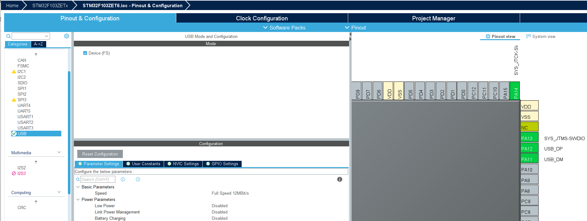
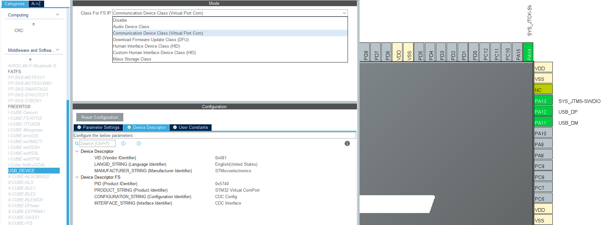
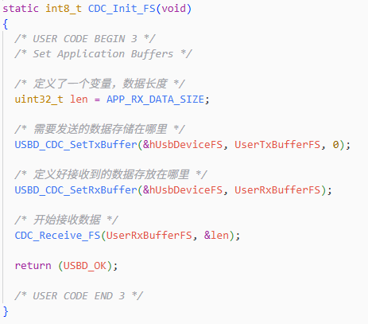
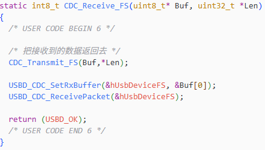

STM32的USB接口是STM32微控制器系列中集成的一种通信接口，它允许STM32微控制器与外部设备或计算机进行高速的数据传输和通信。

## 1 USB分类

### 1.1 按照体积细分

USB Type-A和USB Type-B按照体积大小还可以分为三种类型：

- Standard标准

- Mini小型

- Mirco微型

USB Type-C接口仅有一种造型，而Type-A和Type-B有三种造型：

### 1.2 USB Type-A

- USB2.0 4金属触点

- USB3.0 9金属触点

引脚定义

### 1.3 USB Type-B

### 1.4 USB Type-C

## 2 角色模式

- **设备模式（Device Mode)**：STM32作为USB设备，与USB主机（如电脑）进行通信。在这种模式下，STM32响应主机的命令和数据请求，进行数据传输。
- **主机模式（Host Mode）**：STM32作为USB主机，管理并控制一个或多个USB设备。在这种模式下，STM32可以主动发起数据传输请求，控制USB设备的操作。
- **OTG模式（On-The-Go Mode）**：STM32同时支持设备模式和主机模式，可以在两种模式之间动态切换。OTG模式通过检测USB ID引脚的电平来确定当前的角色，从而灵活地适应不同的应用场景。

### 2.1 电气特性

- **主机端**：USB接口的D+和D-都接有1.5K下拉电阻。

- **全速（FS）**：USB设备的数据线D+接1.5K上拉电阻，一旦接入主机，主机的D+被拉高。

- **低速（LS）**：USB设备的数据线D-接有1.5K的上拉电阻，一旦接入主机，主机的D-会被拉高。

- **高速（HS）**：设备先以 FS 连接，然后发送 chirp 升级到 HS

## 3 STM32F103ZETx

USB Device可选Class的用途说明：

1. **CDC（Communication Device Class）**：虚拟串口（Virtual COM Port），让STM32在PC上显示为一个串口（COMx）。
   - **应用场景**：调试接口、数据传输、AT命令通信
   - **特点**：无需安装驱动（Windows 10及以上）、传输速率高、易于使用
   - **典型用途**：替代传统串口、嵌入式系统调试、数据采集

2. **HID（Human Interface Device）**：人机交互设备类。
   - **Custom HID**：自定义HID设备，可自定义报告描述符
   - **标准HID**：键盘（Keyboard）、鼠标（Mouse）、游戏手柄等
   - **特点**：免驱动、即插即用、Windows/Linux/Mac通用支持
   - **应用场景**：键盘模拟、鼠标模拟、自定义控制面板、游戏外设
   - **数据传输**：中断传输（Interrupt Transfer）、低延迟

3. **MSC（Mass Storage Class）**：大容量存储设备类。
   - **功能**：将STM32模拟成U盘、硬盘等存储设备
   - **应用场景**：SD卡读卡器、Flash存储、数据记录器
   - **特点**：操作系统自动识别、支持FAT32/exFAT文件系统
   - **典型用途**：配置文件读写、固件更新、数据导出

4. **Audio（音频设备类）**：音频输入/输出设备。
   - **Audio Speaker**：音频播放设备（扬声器）
   - **Audio Microphone**：音频录制设备（麦克风）
   - **特点**：支持多种采样率、免驱动
   - **应用场景**：USB声卡、音频播放器、语音识别
   - **数据传输**：等时传输（Isochronous Transfer）

5. **DFU（Device Firmware Update）**：设备固件升级类。
   - **功能**：通过USB接口升级STM32的固件
   - **模式**：DFU Mode（升级模式）和 Runtime Mode（运行模式）
   - **应用场景**：现场固件更新、远程维护
   - **特点**：无需外部编程器、支持加密和签名验证
   - **工具**：STM32CubeProgrammer、DfuSe Utility

6. **CCID（Chip Card Interface Device）**：智能卡接口设备类。
   - **功能**：实现智能卡读卡器功能
   - **应用场景**：身份认证、加密狗、SIM卡读写
   - **特点**：符合ISO 7816标准
   - **典型用途**：USB Key、加密令牌、门禁系统

7. **Printer（打印机类）**：打印设备。
   - **功能**：将STM32模拟成USB打印机
   - **应用场景**：热敏打印机、标签打印机、票据打印
   - **特点**：支持标准打印机协议
   - **数据传输**：批量传输（Bulk Transfer）

8. **RNDIS（Remote Network Driver Interface Specification）**：远程网络驱动接口。
   - **功能**：通过USB实现网络连接
   - **应用场景**：USB网卡、网络共享、IoT设备联网
   - **特点**：Windows原生支持、可分配IP地址
   - **典型用途**：USB转以太网、4G模块、网络调试

9. **Composite Device（复合设备）**：多功能组合设备。
   - **功能**：同时支持多个USB类（如CDC+MSC、HID+CDC等）
   - **应用场景**：多功能调试工具、复杂嵌入式系统
   - **特点**：一个USB端口实现多种功能
   - **常见组合**：
     - CDC + MSC：虚拟串口 + U盘
     - HID + CDC：自定义HID + 虚拟串口
     - Audio + HID：音频设备 + 控制接口

### 3.1 CDC

需要完成以下两个函数补充，就可以直接使用虚拟串口接收到的数据直接返回。

## 参考

[参考1： USB接口那么多！！你都认识吗？？知道他们的区别吗？？_mirco b与 usb a](https://blog.csdn.net/2401_87555420/article/details/143593171)

[参考2： STM32F103C6T6 USB虚拟串口](https://blog.csdn.net/xingyuncao520025/article/details/154385245)

[参考3： STM32F103 HID实现游戏控制器](https://zhuanlan.zhihu.com/p/706856413)
