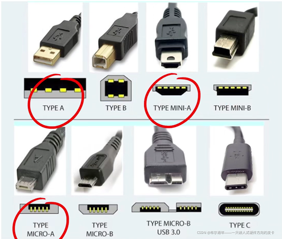
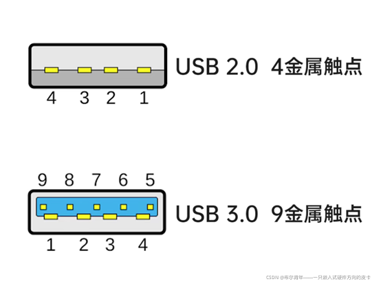
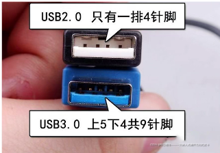
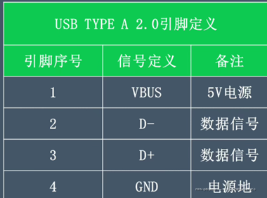
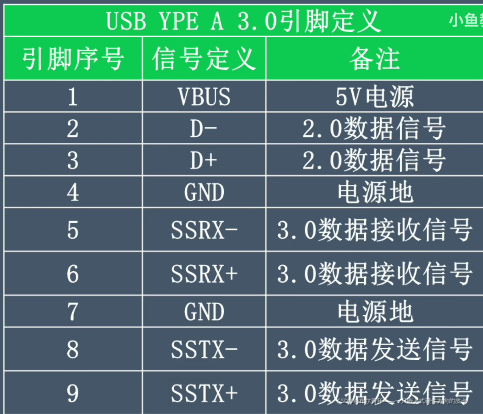
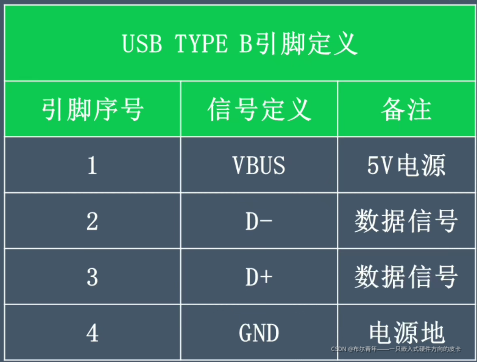
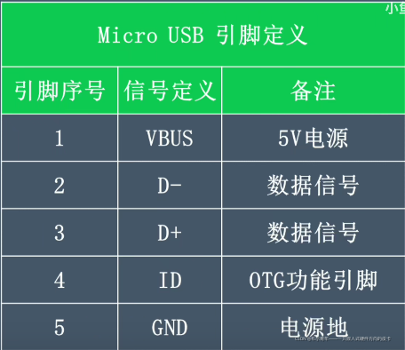
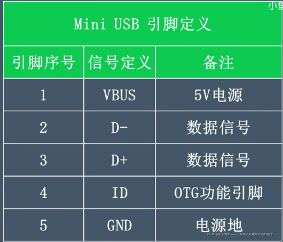
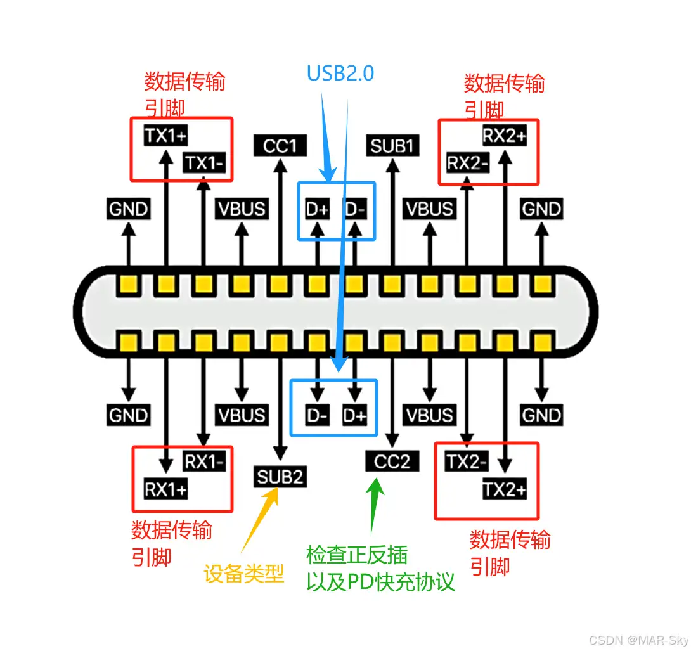

STM32的USB接口是STM32微控制器系列中集成的一种通信接口，它允许STM32微控制器与外部设备或计算机进行高速的数据传输和通信。

## 1 USB分类

### 1.1 按照体积细分

USB Type-A和USB Type-B按照体积大小还可以分为三种类型：

- Standard标准

- Mini小型

- Mirco微型

USB Type-C接口仅有一种造型，而Type-A和Type-B有三种造型：

### 1.2 USB Type-A

- USB2.0 4金属触点

- USB3.0 9金属触点

引脚定义

### 1.3 USB Type-B

### 1.4 USB Type-C

## 2 角色模式

- **设备模式（Device Mode)**：STM32作为USB设备，与USB主机（如电脑）进行通信。在这种模式下，STM32响应主机的命令和数据请求，进行数据传输。
- **主机模式（Host Mode）**：STM32作为USB主机，管理并控制一个或多个USB设备。在这种模式下，STM32可以主动发起数据传输请求，控制USB设备的操作。
- **OTG模式（On-The-Go Mode）**：STM32同时支持设备模式和主机模式，可以在两种模式之间动态切换。OTG模式通过检测USB ID引脚的电平来确定当前的角色，从而灵活地适应不同的应用场景。

### 2.1 电气特性

- **主机端**：USB接口的D+和D-都接有1.5K下拉电阻。

- **全速（FS）**：USB设备的数据线D+接1.5K上拉电阻，一旦接入主机，主机的D+被拉高。

- **低速（LS）**：USB设备的数据线D-接有1.5K的上拉电阻，一旦接入主机，主机的D-会被拉高。

- **高速（HS）**：设备先以 FS 连接，然后发送 chirp 升级到 HS

## 

## 参考

[参考1： USB接口那么多！！你都认识吗？？知道他们的区别吗？？_mirco b与 usb a](https://blog.csdn.net/2401_87555420/article/details/143593171)