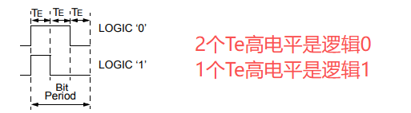
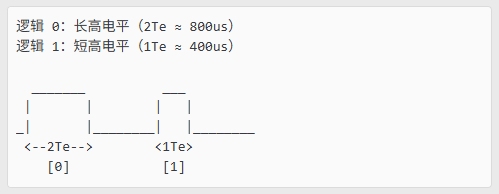
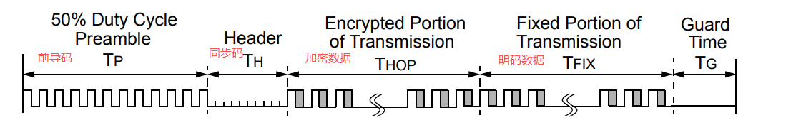
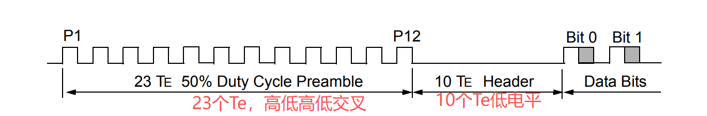
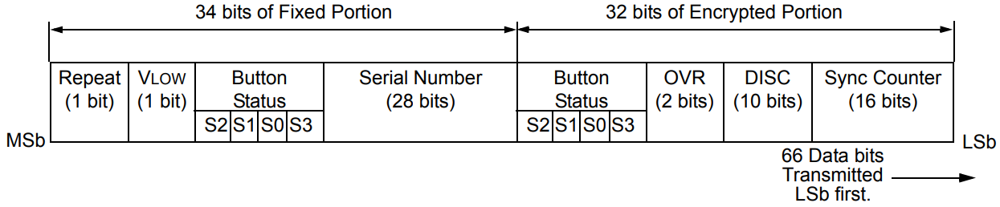
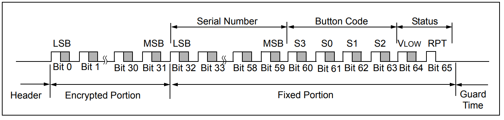

## 1 逻辑定义





Te值的大小在HCS301中EPROM中设定，一般都是 `Te = 400us`

实际测试示例如下：

```
Bit 0: High Time = 361 us, Low Time = 874 us
Bit 1: High Time = 360 us, Low Time = 875 us
Bit 2: High Time = 360 us, Low Time = 874 us
Bit 3: High Time = 362 us, Low Time = 872 us
Bit 4: High Time = 774 us, Low Time = 462 us
Bit 5: High Time = 772 us, Low Time = 462 us
Bit 6: High Time = 772 us, Low Time = 464 us
Bit 7: High Time = 770 us, Low Time = 463 us
Bit 8: High Time = 772 us, Low Time = 463 us
Bit 9: High Time = 772 us, Low Time = 463 us
Bit 10: High Time = 360 us, Low Time = 874 us
Bit 11: High Time = 772 us, Low Time = 455 us
Bit 12: High Time = 374 us, Low Time = 852 us
Bit 13: High Time = 793 us, Low Time = 444 us
Bit 14: High Time = 788 us, Low Time = 448 us
Bit 15: High Time = 786 us, Low Time = 450 us
Bit 16: High Time = 784 us, Low Time = 451 us
Bit 17: High Time = 782 us, Low Time = 452 us
Bit 18: High Time = 371 us, Low Time = 863 us
Bit 19: High Time = 781 us, Low Time = 454 us
Bit 20: High Time = 369 us, Low Time = 863 us
Bit 21: High Time = 781 us, Low Time = 454 us
Bit 22: High Time = 369 us, Low Time = 865 us
Bit 23: High Time = 369 us, Low Time = 866 us
Bit 24: High Time = 779 us, Low Time = 456 us
Bit 25: High Time = 368 us, Low Time = 866 us
Bit 26: High Time = 369 us, Low Time = 865 us
Bit 27: High Time = 781 us, Low Time = 458 us
Bit 28: High Time = 366 us, Low Time = 868 us
Bit 29: High Time = 368 us, Low Time = 865 us
Bit 30: High Time = 371 us, Low Time = 865 us
Bit 31: High Time = 370 us, Low Time = 865 us
Bit 32: High Time = 782 us, Low Time = 455 us
Bit 33: High Time = 369 us, Low Time = 868 us
Bit 34: High Time = 368 us, Low Time = 866 us
Bit 35: High Time = 369 us, Low Time = 867 us
Bit 36: High Time = 780 us, Low Time = 455 us
Bit 37: High Time = 779 us, Low Time = 456 us
Bit 38: High Time = 779 us, Low Time = 457 us
Bit 39: High Time = 778 us, Low Time = 457 us
Bit 40: High Time = 776 us, Low Time = 459 us
Bit 41: High Time = 776 us, Low Time = 461 us
Bit 42: High Time = 775 us, Low Time = 461 us
Bit 43: High Time = 774 us, Low Time = 462 us
Bit 44: High Time = 771 us, Low Time = 464 us
Bit 45: High Time = 770 us, Low Time = 463 us
Bit 46: High Time = 772 us, Low Time = 466 us
Bit 47: High Time = 768 us, Low Time = 467 us
Bit 48: High Time = 768 us, Low Time = 467 us
Bit 49: High Time = 768 us, Low Time = 469 us
Bit 50: High Time = 765 us, Low Time = 469 us
Bit 51: High Time = 766 us, Low Time = 473 us
Bit 52: High Time = 762 us, Low Time = 472 us
Bit 53: High Time = 762 us, Low Time = 472 us
Bit 54: High Time = 763 us, Low Time = 475 us
Bit 55: High Time = 760 us, Low Time = 474 us
Bit 56: High Time = 761 us, Low Time = 473 us
Bit 57: High Time = 762 us, Low Time = 476 us
Bit 58: High Time = 758 us, Low Time = 476 us
Bit 59: High Time = 759 us, Low Time = 478 us
Bit 60: High Time = 756 us, Low Time = 476 us
Bit 61: High Time = 759 us, Low Time = 479 us
Bit 62: High Time = 345 us, Low Time = 891 us
Bit 63: High Time = 756 us, Low Time = 479 us
Bit 64: High Time = 756 us, Low Time = 480 us
Bit 65: High Time = 755 us, Low Time = 11287 us

Bits: 11110000 00101000 00101011 01101111 01110000 00000000 00000000 00000010 00
```

## 2 编码格式



- **Tp**：前导码由23个Te组成，Te之间的高低电平占比50%。

- **Th**: 同步码由10个Te组成，10个Te全部都是低电平。

- **Thop**: 加密数据部分。

- **Tfix**：明码数据部分。

### 2.1 前导码

前导码数据如下，每次高低电平都是一个Te左右。一共有23个Te。

实际测试：

```
TP 1: High Time = 429 us, Low Time = 437 us
TP 2: High Time = 384 us, Low Time = 439 us
TP 3: High Time = 384 us, Low Time = 438 us
TP 4: High Time = 384 us, Low Time = 437 us
TP 5: High Time = 385 us, Low Time = 438 us
TP 6: High Time = 385 us, Low Time = 436 us
TP 7: High Time = 385 us, Low Time = 438 us
TP 8: High Time = 385 us, Low Time = 436 us
TP 9: High Time = 386 us, Low Time = 435 us
TP 10: High Time = 386 us, Low Time = 436 us
TP 11: High Time = 387 us, Low Time = 435 us
```

### 2.2 同步码



下面的这个测试数据，起始高电平部分属于前导码，同步码就是10个Te低电平。

实际测试：

```
High Time = 406 us, Low Time = 4220 us
```

### 2.3 66位数据






完成解析代码参考：`RFID_STM32G0` 项目。