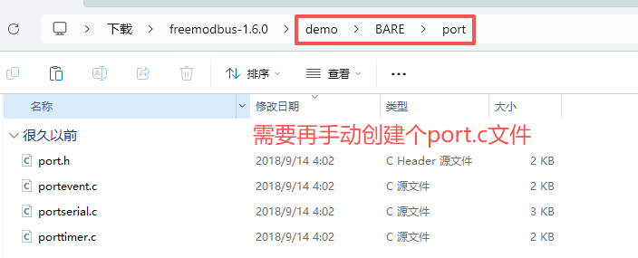
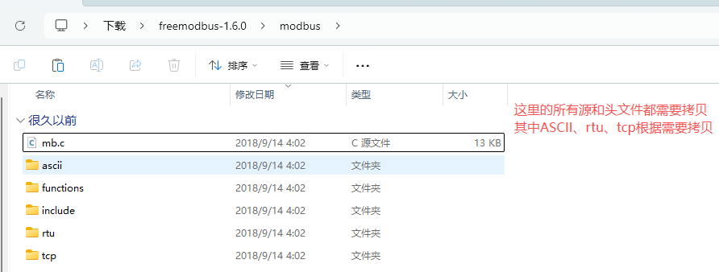
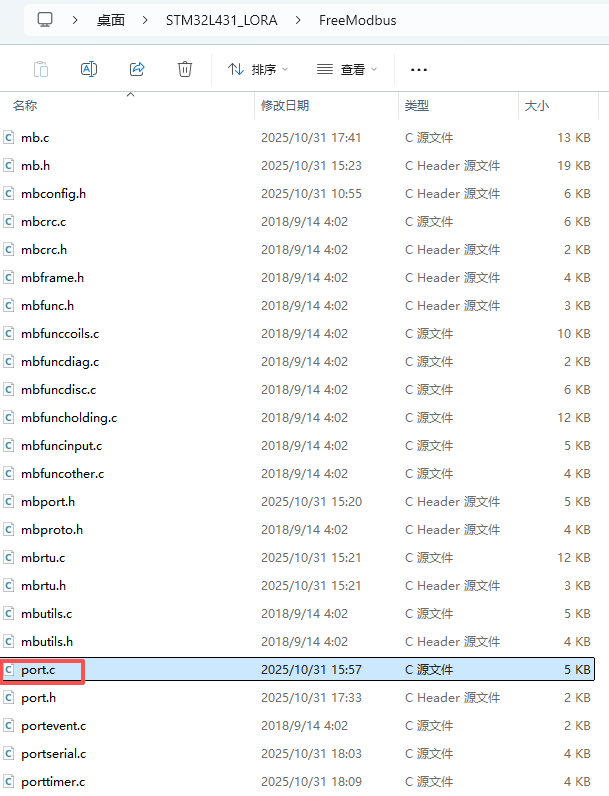
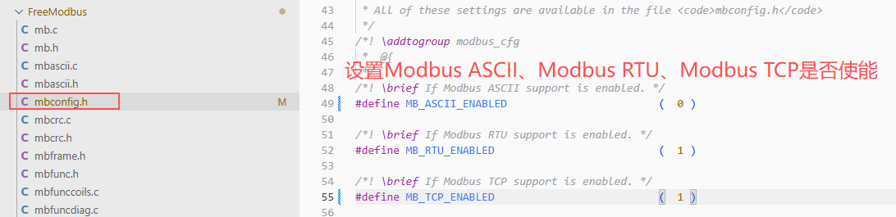
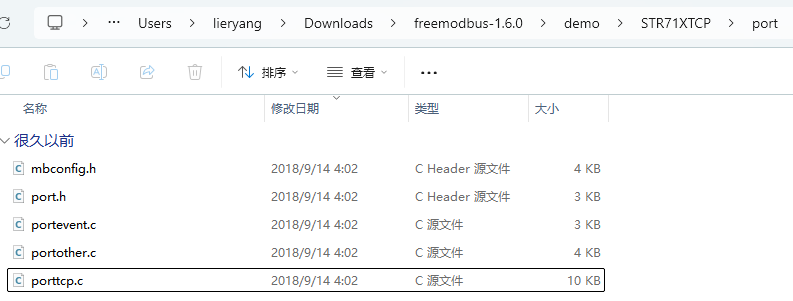

## ModbusRTU移植





把上面的所有头和源文件拷贝到STM32开发目录下，还需要再手动创建一个 `port.c` 文件。



需要修改以下文件：

- **port.h**: 进出临界条件（全局中断开和关）。

    ```c
    #define ENTER_CRITICAL_SECTION( )   __disable_irq()
    #define EXIT_CRITICAL_SECTION( )    __enable_irq()
    ```

- **port.c**: 实现功能指令读写寄存器，还有寄存器存储定义之类。主要包含：
  - 寄存器映射表定义（输入寄存器、保持寄存器等）
  - 读取输入寄存器回调函数 `eMBRegInputCB`
  - 读写保持寄存器回调函数 `eMBRegHoldingCB`
  - 读写线圈回调函数 `eMBRegCoilsCB`
  - 读写离散输入回调函数 `eMBRegDiscreteCB`

- **portserial.c**: 串口移植文件，需要配置STM32的UART硬件：
  - 初始化串口参数（波特率、数据位、停止位、校验位）
  - 实现串口发送函数 `xMBPortSerialPutByte`
  - 实现串口接收中断处理
  - 配置串口收发使能控制（RS485方向控制）

- **porttimer.c**: 定时器移植文件，用于Modbus RTU帧间隔检测：
  - 配置STM32定时器（通常使用3.5个字符时间作为帧间隔），<font color="red">注意是要把预分频后频率设置成50us计数一次。参数表示的意思是多少个50us。</font>
  - 实现定时器初始化函数 `xMBPortTimersInit`
  - 实现定时器启动/停止函数
  - 定时器中断处理函数，用于检测RTU帧结束

- **mbconfig.h**: 设置ModbusRTU、ModbusTCP、ModbusASCII相关函数定义使能。

- **portevent.c**: 事件处理移植文件，用于Modbus协议栈的事件通信：
  - 实现事件初始化函数 `xMBPortEventInit`
  - 实现事件发送函数 `xMBPortEventPost`，用于向协议栈发送事件
  - 实现事件获取函数 `xMBPortEventGet`，用于从事件队列中获取事件
  - 在裸机系统中通常使用简单的标志位或状态机实现
  - 在RTOS系统中可以使用消息队列、信号量等机制




## ModbusTCP移植

Lwip移植使用ModbusTCP可以参考：`freemodbus-1.6.0\demo\STR71XTCP\port`



